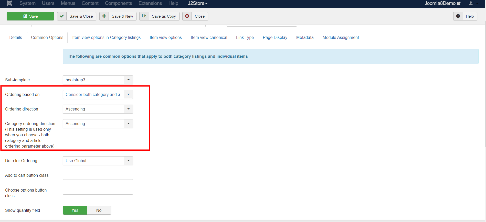

# Ordering products on your storefront

Organizing your products is an important factor in increasing the user-friendliness of your store. The following article describes how your products could be organized.

## Options available: 

Ordering options could be found under Menus > Manage&#x20;

Find your product’s menu item > Common options > Article order.

### The following are the options: 

**Use global** - This would display the articles in the order as specified on the Joomla Global configuration (under System > Global Configuration > Articles > Shared > Article order).

**Featured products (articles) first**- The products that are marked as featured would be listed first, followed by the others.

**Most recent first** - The most recently created products/ articles would be listed first. **Oldest first**- This option would allow the products that are the oldest to be displayed first.

**Title alphabetical**- With this option, you could sort your products based on their titles in alphabetical order. **Title reverse alphabetical**- This option would sort the products in reverse alphabetical order.

**Author Alphabetical**- The products would be sorted based on their author names alphabetically. **Author reverse alphabetical**- Products will be ordered based on their author names in reverse alphabetical order.

**Most hits**- The products that have received the most hits would be listed first. **Least hits**- The products with the fewest hits would appear first.

**Article order**- The order in which they are sorted in the Content->articles part would be the order of the products at the frontend.

**Consider both Category and Article ordering:** With this option, you could sort your products based on the ordering of the Categories and also the products/articles within the Category, either in Ascending or Descending order.

**Ordering Direction& Category Ordering Direction:**

Choose whether the Product Articles should be ordered alphabetically from A to Z (ascending) or from Z to A (descending).

The value you choose here should be the same as the one chosen under Content > Articles > Sort Table by:

Similarly, for the category ordering direction, the value chosen at the menu should match the one chosen at the Content > Categories > Sort table by option.

**For Example,** let us consider that you have a Clothing store and there are two Categories, one as Men's Clothing with various products such as belts, hats, T-shirts, shirts, and so on, and the other as Women's Clothing with products as Tops, Skirts, Jeans, and so on.

Let us assume that you wish to create a menu which displays all the products of all the above categories in the following category order:

* The products of the Men's category should be displayed in ascending order.
* Then the products of the Women's category should be listed in ascending order.

Let us learn how this ordering can be achieved.

1\) Go to Menu Manager > YOUR PRODUCT MENU > Common options tab.

2\) Set the article ordering option to **Consider both category and article ordering.**

3\) Set the option Ordering direction to Order ascending in the same tab.

4\) Set the Category ordering direction to Order ascending in the same tab.

4\) Navigate to content->categories, sort the categories in alphabetical order by dragging and dropping them.

5\) Set the option to **sort the table by** in the top left corner to **Order ascending**

6\) Similarly, navigate to Content->articles->set the sort table by option here as **ascending.**

7\) Set the option to **sort the table by** in the top right corner to **Order ascending.**

8\) Now, at the frontend, all the products should be displayed as per the categories and products in ascending order.

#### Video Tutorial


