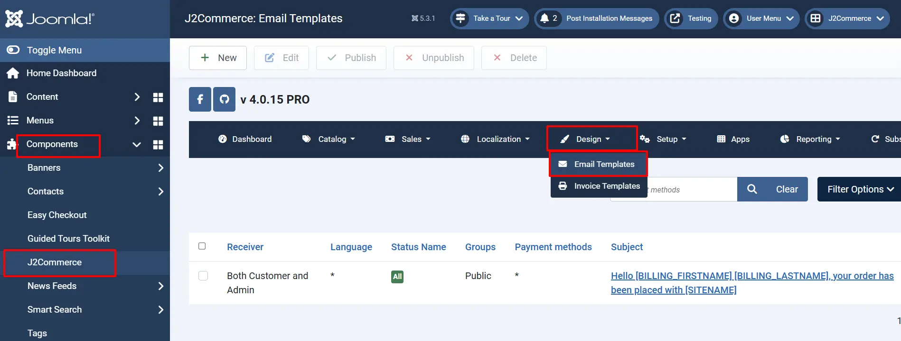
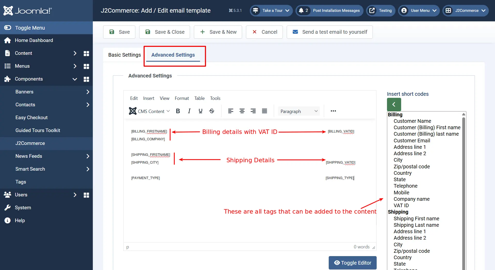
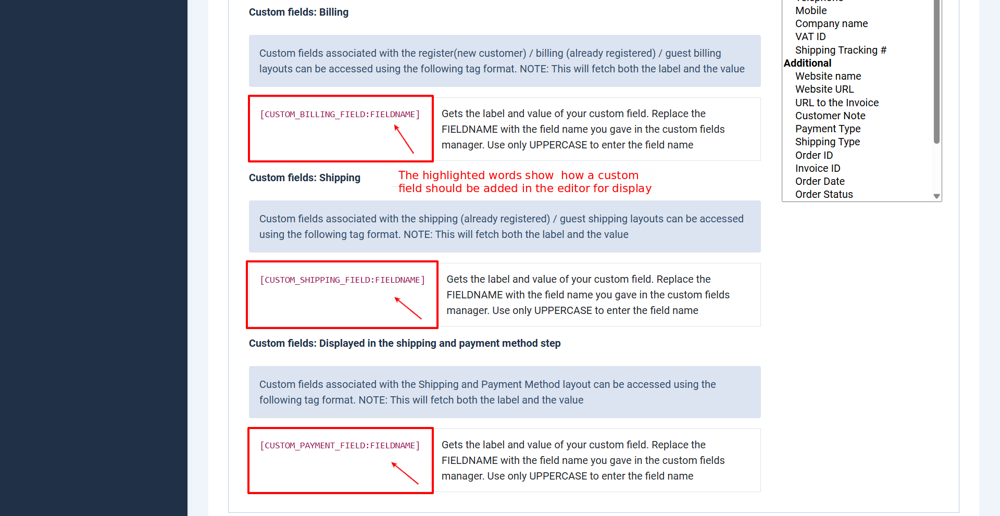

# Email templates

You can customize the email notifications sent to customers when they place an order. The email templates offer a wide range of short codes to include dynamic data like order information and customer information in the email notification.

## Customizing the template <a href="#customizing-the-template" id="customizing-the-template"></a>

**Free version**

Write a language override for the following constants:

J2STORE\_ORDER\_EMAIL\_TEMPLATE\_STANDARD\_SUBJECT

This is the subject of the email

J2STORE\_ORDER\_EMAIL\_TEMPLATE\_STANDARD\_BODY

This controls the body of the email.

Refer to the below for all the short codes that can be used in the email template

**PRO version**

In the Pro version, you have the ability to create the email template from the backend. And you also have the ability to apply different restrictions for them.

To create an email template, follow the steps as shown with the help of images.

**Go to Components > J2Commerce > Design > Email Template**



From the resulting page, click on '**New'** in the top left corner.


## How to create an email template? <a href="#how-to-create-email-template" id="how-to-create-email-template"></a>

You will get two settings tabs to fill up for creating an email template. They are

* Simple Editor (recommended)
* Advanced Template File

<figure><figcaption></figcaption></figure>

**Simple:** The fundamental requirements of a template. Let us see one by one.

**Receiver:** Choose the mail receiver to whom the mail should be sent. Sometimes you may want to send a mail to only the customer or both the admin and customer, or to send the store admin only. In this case, you can use this option to choose the mail receiver.

**Language:** The languages for which the template is compliant are set here. You can select **All** for all languages.

**Order Status:** A specific order status can be selected for emailing the necessary intimation to be sent. It can be any one of the options listed. If email has to be sent for multiple options, then multiple templates have to be created.

**Groups:** Here, the user group from which the email can be sent is selected.

**Payment Methods:** The payment methods that are covered for emails can be selected here.

**Enabled:** It has to be enabled first to send email.

**Subject:** A short one-line info about the content of the email.

**Template Body Source:** The source used to design the email template is selected here. There are two options to choose from. They are:

1. **Simple Editor**
2. **Template List**

After you select an option from the list, you have to **Save** it once. Then, only you can set the advanced tab.

In **Simple Editor**, the content of the email body can be designed here. There are so many options available to customize the content. There is a rich text editor that helps format the content. The facilities that are available in the editor:

* Cut, Copy, Paste
* Insert links or images
* Formatting the text in the body like bold, italicize, line spacing, underlining, and much more
* Insert tables
* Insert source code, etc.

Full articles can also be added to the content from other external sources.

In the **Template List**, you can have a list of templates in the form of .php files. You can select from the available ones in the advanced tab.

**Advanced**

If you have selected **Simple Editor** in the **Basic Tab**, then the **Advanced Tab** will look like the image below.



There are a number of tags listed on the extreme right of the editor from where they can be added to the editor content.

## How to add custom fields inside the email template? <a href="#how-to-add-custom-fields-inside-email-template" id="how-to-add-custom-fields-inside-email-template"></a>

Also, you can add custom fields you have created in the editor. To add a custom field in the editor for display, you need to follow the format given below:

\[CUSTOM\_BILLING\_FIELD:FIELDNAME]

Keep in mind the following when you add a custom field to the editor:

* The custom field should be enclosed in \[]
* All the letters should be in CAPITAL letters
* ‘CUSTOM’ is the first word inside the \[]
* Next, the section in which you have created the field, like ‘BILLING\_FIELD’
* And finally, the field name

Refer to the image below for more clearer understanding.



## How to create a template override for the items table showing in the order email? <a href="#how-to-create-template-override-for-items-table-showing-in-the-order-email" id="how-to-create-template-override-for-items-table-showing-in-the-order-email"></a>

If you would like to customize the order item table shown in an order email notification, that could be possible by creating a template override. Carrying out customizations through template override will not overwrite the changes if you update it in the future.

Here are the instructions to be followed:

The file that controls the items table is located at

/components/com\_j2store/views/myprofile/tmpl/orderitems.php

Copy the above file and paste it under

/templates/YOUR-SITE-TEMPLATE/html/com\_j2store/myprofile/orderitems.php

Edit

/templates/YOUR-SITE-TEMPLATE/html/com\_j2store/myprofile/orderitems.php

Make your changes and save.

## How to add the logo to your Email Template? <a href="#how-to-add-logo-in-your-email-template" id="how-to-add-logo-in-your-email-template"></a>


## Short codes <a href="#short-codes" id="short-codes"></a>

```
[SITENAME]
[SITEURL]
[INVOICE_URL]
[ORDERID]
[INVOICENO]
[ORDERDATE]
[ORDERSTATUS]
[ORDERAMOUNT]
[CUSTOMER_NAME]
[BILLING_FIRSTNAME]			
[BILLING_LASTNAME]			
[BILLING_EMAIL]				
[BILLING_ADDRESS_1]			
[BILLING_ADDRESS_2]			
[BILLING_CITY]			
[BILLING_ZIP]				
[BILLING_COUNTRY]			
[BILLING_STATE]				
[BILLING_COMPANY]			
[BILLING_VATID]			
[BILLING_PHONE]			
[BILLING_MOBILE]			
[SHIPPING_FIRSTNAME]			
[SHIPPING_LASTNAME]			
[SHIPPING_ADDRESS_1]			
[SHIPPING_ADDRESS_2]			
[SHIPPING_CITY]			
[SHIPPING_ZIP]			
[SHIPPING_COUNTRY]			
[SHIPPING_STATE]			
[SHIPPING_COMPANY]			
[SHIPPING_VATID]			
[SHIPPING_PHONE]			
[SHIPPING_MOBILE]			
[SHIPPING_METHOD]			
[SHIPPING_TYPE]			
[SHIPPING_TRACKING_ID]			
[CUSTOMER_NOTE]			
[PAYMENT_TYPE]			
[ORDER_TOKEN]		
[COUPON_CODE] 
[ITEMS] (This displays all items in the order)
```

**Video tutorials**






