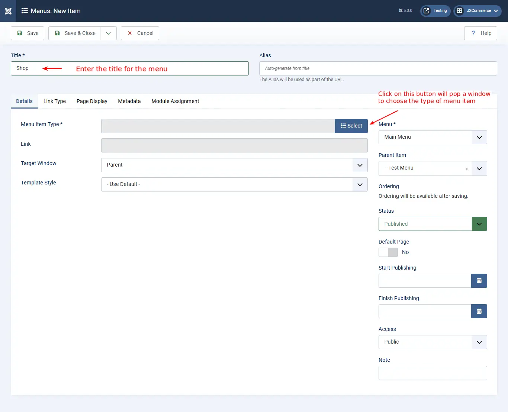
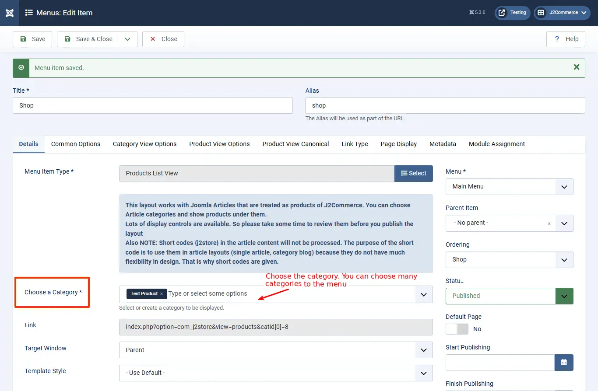
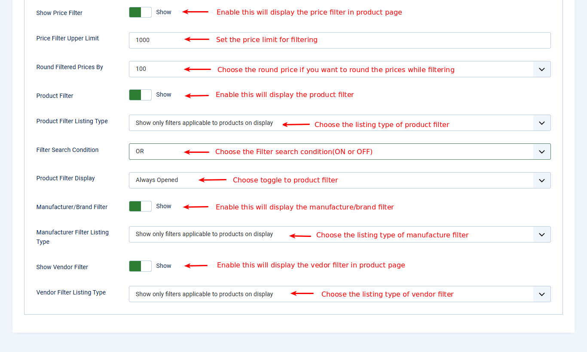
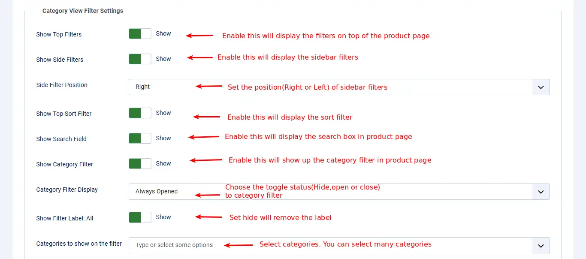
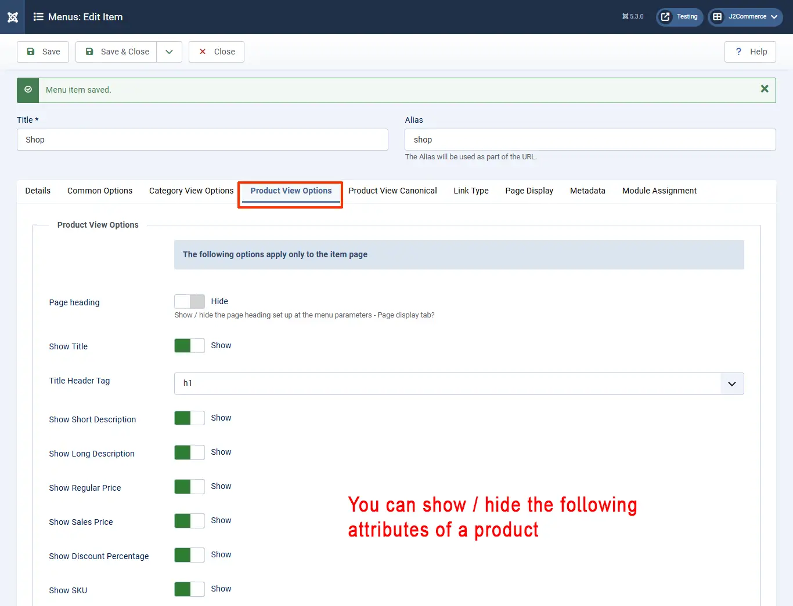
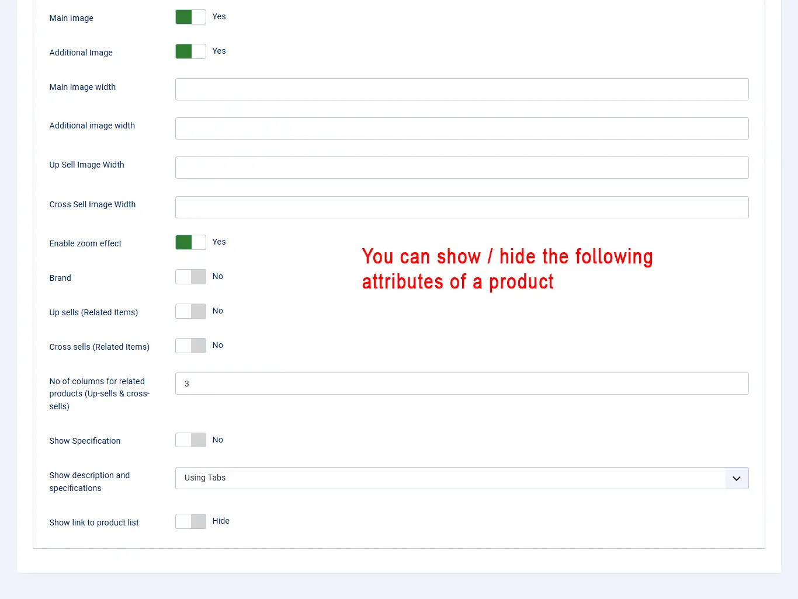

# Products List View

Product Layout is a powerful feature that enables the user to customize the display options and descriptions of the product. In this section, you’ll learn how to create and customize a product layout.

Note: Product layout works only with Joomla articles. If you use SEBLOD / FLEXIcontent / or any other catlog systems, then you may need to configure the product layouts using their menu items.

## Create a Product Layout <a href="#create-a-product-layout" id="create-a-product-layout"></a>

To create a product layout, go to joomla control panel and click on the menu item **Menus -> Main Menu** as shown in the image below.


You will get the list of menus that are already present as shown in the image below.


To create a new item, click on the **New** button and you will get this page.



First you need to enter the title of the item you create. For example, it is entered with **Shop**. The alias will be automatically generated based on the title. Then, you have several tabs in this page. Let us see one by one. First is the **Details** tab.

## Details Tab <a href="#details-tab" id="details-tab"></a>

Here, you choose the **Menu Item Type** by clicking on the ‘Select’ button. You will get a pop-up window like this:


In this pop-up window, select **J2Commerce** and you will get a list to choose from. From the list, select **Products List View** and close the window. You will see your selection as shown in the below image.

Your menu item is selected and the link is also created automatically. click on the **Choose a Category** text box to choose the product categories listed. You can add many categories in this box. Refer the image below.



Now, go to next tab, **Common Options**.

## Common Options Tab <a href="#common-options-tab" id="common-options-tab"></a>

.webp>)

This tab has the common settings for all items. If you want to show images for product options or if you want to add some custom CSS code, you can do that here. Otherwise, you can leave them as they are.

Note: In Sub-Template option, you have to choose **bootstrap5** if your bootstrap version is 3x.&#x20;

If you do not want to show product option price in front end, you can set the option to **Hide** as shown in the image below:&#x20;

## Category View Options Tab <a href="#item-view-options-in-category-listings" id="item-view-options-in-category-listings"></a>

Check the image below:


In this tab, you are setting the configuration for how to display the product in the cart and the features and options to display with the product.

You can display any number of products as you like in the shop. Enter the no of products to be displayed in the text box provided and the number of columns in which the product display is divided. As the no of products increases, the image display size will be decreased.

Also, select all other options as per your choice. Refer the next image.

.webp>)

From the image you can see that there are many options available to set the price, image, size of the image and many more attributes.

CAUTION: SKU Show/Hide setting can be done in two places, i.e., in configuration setup and in product layout. Product layout setting will be given higher priority, i.e., if SKU is set to **Show** in configuration and again it is set to **Hide** in product layout, the configuration setting will be overridden and the SKU will be set to **Hide** as it is in product layout. As a result, SKU will not be shown in frontend.

Next image shows the filters.





Filters help narrow the search for a particular product. There are many filters available for the search.

* Sort Filter
* Search Box
* Category Filter
* Price Filter
* Product Filter
* Manufacturer / Brand Filter
* Vendor Filter

One or more filters can be applied as per the needs of the customer.

## Product View Options Tab <a href="#item-view-options-tab" id="item-view-options-tab"></a>

In this tab, you will set the configuration for what to display with the product, like price, description, image etc.

See the image below:



This image shows the options you have to set the configuration for a product on what has to be displayed along with the product. The available options are:

* Title
* Short Description
* Long Description
* Regular Price
* Special Price
* Discount Percentage
* SKU
* Stock
* Main Image
* Additional Images
* Main Image Width
* Additional Image Width
* Enable Zoom Effect
* Brand
* Upsells
* Cross Sells
* No of columns for related products
* Show Specification
* Show description and specifications
* Show link to product list
*



Using this parameters, you can determine what are the details and how they should be displayed in the online shop.

Apart from these four tabs, there are four more tabs and they should be left with the default settings. You need not worry about that.

Now, Save the item by clicking the **Save & Close** button. You will get the screen as shown in the image below.

In this image, you can see that the new menu item created is listed in the top with the other menu items. You can click that to see the products of your store, like the image below.


In this page, you can see the product layout features. The filters are positioned in the right side as per the selected choice. You have the option to filter by price, brand, vendor etc. The regular and special prices are also displayed along with discount percentage variation.



Let us see how images are added in the backend and how they are displayed in frontend view. Consider the image below:

.webp>)

In the image, you can see Main and Additional images added to the product configuration. When you configure your product, you will add images of the product for its view in the cart. You add the main image of the product for the main view supported with additional images. Let us now check how it is viewed in the front end.

Check the image below:


When you click on the product, it will be displayed with large image and additional images displayed below in small size. When you hover over the small images, you can see them in place of the main image. The below image explains this activity.


Like this, you can set different product layouts according to your wish and needs.

## Special Module Positions <a href="#special-module-positions" id="special-module-positions"></a>

J2Commerce offers special module positions to place the Joomla’s custom HTML module. Following are the custom module positions :

1. j2store-single-product-top - Top of product view layout
2. j2store-single-product-bottom - Bottom of product view layout
3. j2store-product-list-top - Top of product category listing page
4. j2store-filter-left-top - Top of left filter
5. j2store-filter-left-bottom - Bottom of left filter
6. j2store-filter-right-top - Top of right filter
7. j2store-filter-right-bottom - Bottom of right filter
8. j2store-product-list-bottom - Bottom of product category listing page
9. j2store-cart-top - Top of cart page
10. j2store-cart-bottom - Bottom of cart page
11. j2store-checkout-top - Top of checkout page
12. j2store-checkout-bottom - Bottom of checkout page

## Avoid Zoom effect and open the main image in popup <a href="#avoid-zoom-effect-and-open-the-main-image-in-popup" id="avoid-zoom-effect-and-open-the-main-image-in-popup"></a>

To avoid the zomm effect and to bring the image in pop up, first thing you have to do is disable the zoom effect in admin backend.\\

**Disable zoom in J2store / J2Commerce product layout**

Go to menu manager and open the menu which links to J2store product layout.

Move to Item view options tab

Set **NO** to Enable Zoom effect.

**Disable zoom in Category blog layout**

Go to Extensions > Plugins.

Select type **content**.

Open the Content - J2Store plugin.

Set **NO** to Enable Zoom effect in Item view tab.

**Override view\_images.php**

Once disbaled the zoom effect, follow the override procedure given below :

Copy\*\* /components/com\_j2store/templates/default/view\_images.php\*\*

to

**/templates/YOUR\_TEMPLATE/html/com\_j2store/templates/default/view\_images.php**

Open the file and on around line no 22 find the below code:

```
<span class="<?php echo $class; ?>"     id="j2store-item-main-image-<?php echo $this->product->j2store_product_id; ?>"><br>		 &nbsp;	 		 &nbsp;	 alt="<?php echo $this->product->product_name ;?>"<br>		 &nbsp;	 class="j2store-product-main-image j2store-img-responsive" src="/<?php echo $image_path.$main_image;?>"<br>		 &nbsp;	 width="<?php echo intval($main_image_width); ?>"<br>		 &nbsp;	 /><br>		 &nbsp;	 </span>
```

Change this with

```
&nbsp;<span class="<?php echo $class; ?>" id="j2store-item-main-image-<?php echo $this->product->j2store_product_id; ?>"><br>		 &nbsp; <?php JHTML::_('behavior.modal', 'a.modal'); ?><br>		 &nbsp;	 <a href="<?php echo $this->product->main_image;?>" class="modal">		 &nbsp;	 alt="<?php echo $this->product->product_name ;?>"<br>		 &nbsp;	 class="j2store-product-main-image j2store-img-responsive"<br>		 &nbsp;	 src="<?php echo $image_path.$main_image;?>"<br>		 &nbsp;	 width="<?php echo intval($main_image_width); ?>"<br>		 &nbsp;	 /></a><br>		 &nbsp;	 </span>
```

## Common Problems <a href="#common-problems" id="common-problems"></a>

**Grid layout not working/columns. Why?**

The issue seems to be the wrong sub-template.

Open your product list layout menu. In the Common options tab -> set the sub-template as Bootstrap3.

Save

This should solve the issue. If it is already set to Bootstrap 3, then try to set it as Default.

**Preview additional image after clicking**

copy the file /components/com\_j2store/templates/default/view\_images.php

to

**/templates/YOUR\_TEMPLATE/html/com\_j2store/templates/default/view\_image.php**

edit the file and remove the highlighted line fully.

**How to add Category description in list view**

* Create custom module and assign it to the menu that links to the J2Commerce product layout.
* Set the module position to j2Commerce-product-list-top.
* Save.

Now the custom module will display the description only in list view.
