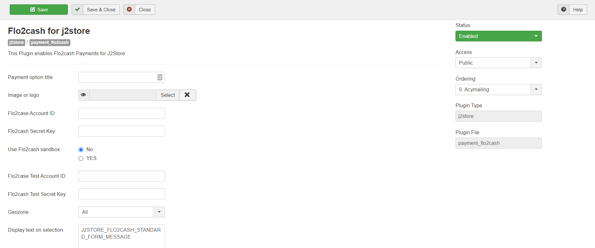
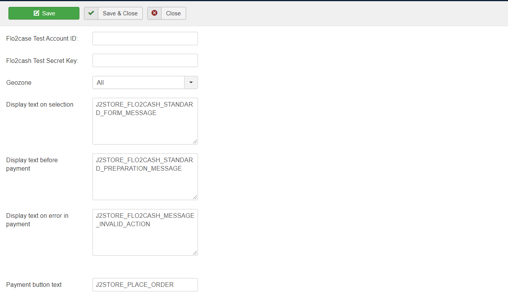

# Flo2Cash for J2Store

## Requirements

1. PHP 8.1.0 +
2. Joomla! 4.x/ Joomla! 5.x +
3. J2Commerce / J2Store 4.x +

## Installation 

1. Download Flo2Cash payment plugin package from our site’s extensions section and install it using Joomla installer.
2.  After installing plugin, go to J2Store > Setup > Payment methods and enable Flo2Cash

    for J2Store.
3. Once enabled, open / edit the plugin and configure the basic settings of the app.

## Configuration 

**Payment option title:** You may enter the title of the payment method you wish to display at the frontend in checkout here. If left blank, the default payment text will be displayed.

**Image or logo:** You may consider adding an image for the payment method to be listed in the checkout page next to the payment method in frontend.

**Flo2Case Account ID:** You may enter the Flo2Case Account ID associated with your Flo2Case Account.

**Flo2Cash Secret Key:** You may enter the Flo2Cash Secret key associated with your Flo2Case Account.

**Use Flo2Cash Sandbox:** This option allows you to test the Flo2Cash gateway using the Flow2Cash server instead of the live one. Use this option to test the plugin if you do not have a Flo2Cash account yet.

**Flo2Case Test account ID:** You may enter the Flo2Case Test Account ID associated with your Flo2Case Account.

**Flo2Cash Test Secret Key:** You may enter the Flo2Cash Test Secret key associated with your Flo2Case Account.

**Geozone:** You can restrict showing this payment method only to the customers who belong to the selected geozone. Choose All in order to display this payment option to all customers.

**Display Text on Selection:** The text entered here will be displayed when customer selects this payment method. You can enter a language constant as a value here if you are using a multi-lingual site and then write a language override. Refer the tips below.

**Tip - ONLY FOR MULTI-LINGUAL SITES**

For example, enter a language constant:

J2STORE\_\_TEXT\_\_TO\_\_DISPLAY\_\_ON\_SELECTION

Now you can go to Joomla admin-> Language Manager->Overrides and create overrides for the language constant in all your languages.

**Display Text before Payment:** The text entered here will be displayed to the customer at the order summary screen before he makes the payment. You can enter a language constant as a value here if you are using a multi-lingual site and then write a language override. Refer the Display text on selection parameter.

**Display Text after Payment:** The text entered here will be displayed to the customer after he makes the payment. You can enter a language constant as a value here if you are using a multi-lingual site and then write a language override. Refer the Display text on selection parameter.

**Display Text on Error in Payment:** The text entered here will be displayed to the customer when there is an error in the payment process. You can enter a language constant as a value here if you are using a multi-lingual site and then write a language override. Refer the Display text on selection parameter.

**Display Text on Cancel Payment:** The text entered here will be displayed to the customer when he cancels the payment at the gateway (NOT in your site). You can enter a language constant as a value here if you are using a multi-lingual site and then write a language override. Refer the Display text on selection parameter.

**Payment Button Text:** The text of the payment button. The button will be displayed at the final checkout step.

**DEBUG :** This option is chosen in order to enable or disable the display of log file. This should be in disable for live sites.

Thus, once you have mentioned the necessary details for the above parameters, you are ready to receive payments via Flo2Cash on your store.

