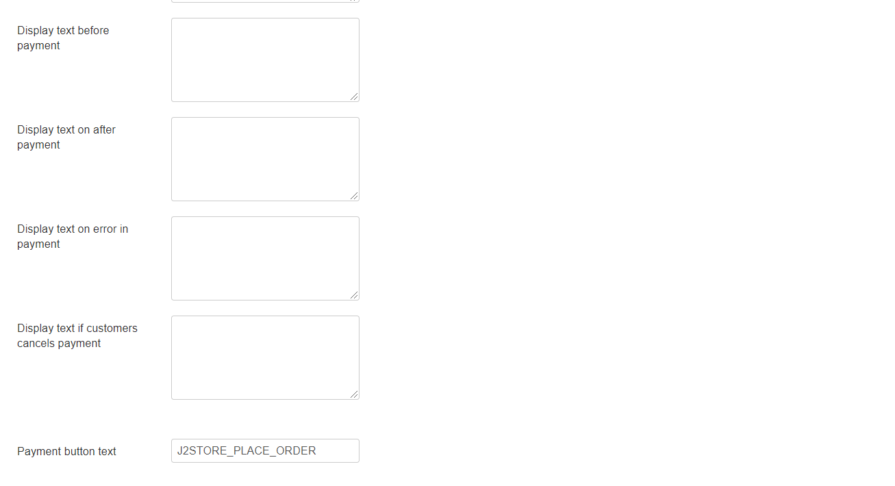

# Payment Express for J2Store

This plugin integrates Payment Express payment gateway with J2Store.

## Requirements

1. PHP 8.1.0 +
2. Joomla! 4.x/ Joomla! 5.x +
3. J2Commerce / J2Store 4.x +

## Installation 

1. Download paymentExpress plugin package from our site’s extensions section and install it using Joomla installer.
2.  After installing plugin, go to J2Store > Setup > Payment methods and enable PaymentExpress

    for J2Store.
3. Once enabled, open / edit the plugin and configure the basic settings of the app.

## Configuration 

**Payment option title:** You may enter the title of the payment method you wish to display at the frontend in checkout here. If left blank, the default payment text will be displayed.

**Plugin Display Image:** You may consider adding an image for the payment method to be listed in the checkout page next to the payment method in frontend.

**PX User ID:** Please enter express User ID associated with your Express account.

**Secret Key:** Please enter express Secret Key associated with your Express account.

**Transaction Type:** Please select the Express Transaction Type associated with your Express account.

**Merchant Reference:** The text entered here will be used to generate Merchant Reference.

**Article ID for Thanks Msg:** You can create a Joomla Article to say thanks to the users, who purchased in your online store. Enter the article ID here.

**Display Text on Selection:** The text entered here will be displayed when customer selects this payment method. You can enter a language constant as a value here if you are using a multi-lingual site and then write a language override. Refer the tips below.

**Tip - ONLY FOR MULTI-LINGUAL SITES**

For example, enter a language constant:

J2STORE\_\_TEXT\_\_TO\_\_DISPLAY\_\_ON\_SELECTION

Now you can go to Joomla admin-> Language Manager->Overrides and create overrides for the language constant in all your languages.

**Display Text before Payment:** The text entered here will be displayed to the customer at the order summary screen before he makes the payment. You can enter a language constant as a value here if you are using a multi-lingual site and then write a language override. Refer the Display text on selection parameter.

**Display Text after Payment:** The text entered here will be displayed to the customer after he makes the payment. You can enter a language constant as a value here if you are using a multi-lingual site and then write a language override. Refer the Display text on selection parameter.

**Display Text on Error in Payment:** The text entered here will be displayed to the customer when there is an error in the payment process. You can enter a language constant as a value here if you are using a multi-lingual site and then write a language override. Refer the Display text on selection parameter.

**Display Text on Cancel Payment:** The text entered here will be displayed to the customer when he cancels the payment at the gateway (NOT in your site). You can enter a language constant as a value here if you are using a multi-lingual site and then write a language override. Refer the Display text on selection parameter.

**Payment Button Text:** The text of the payment button. The button will be displayed at the final checkout step.

Thus, once you have mentioned the necessary details for the above parameters, you are ready to receive payments via PaymentExpress on your store.

