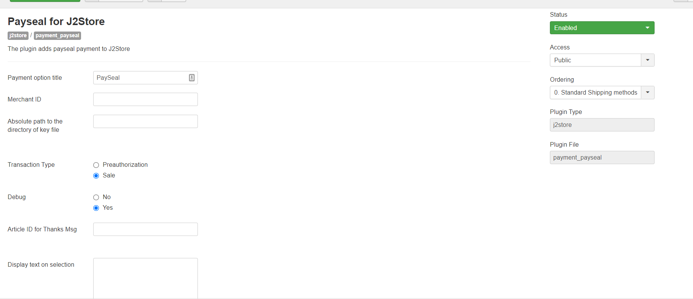
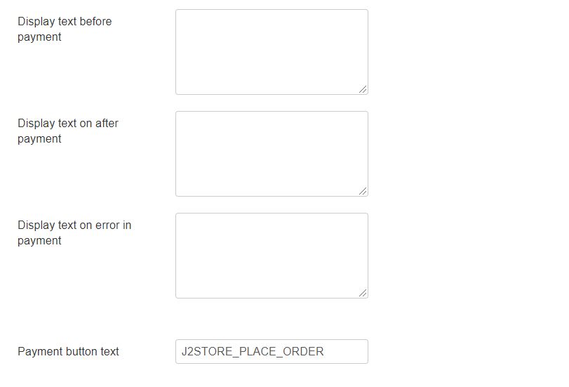

# Payseal Payment Plugin

This plugin integrates the ICICI Payseal Payment gateway with J2Store.

## Requirements

1. PHP 8.1.0 +
2. Joomla! 4.x/ Joomla! 5.x +
3. J2Commerce / J2Store 4.x +

## Installation 

1. Download Paysera payment plugin package from our site’s extensions section and install it using Joomla installer.
2.  After installing plugin, go to J2Store > Setup > Payment methods and enable Paysera

    for J2Store.
3. Once enabled, open / edit the plugin and configure the basic settings of the app.

## Configuration 

**Payment Option Title** The value entered here will be used as the title for this payment method. Customer will see this value when he checks out.

**Merchant ID** The merchant ID provided by Payseal.

**Absolute Path to the directory of key file** Upload the key file provided by the ICICI to a location in your website and enter its absolute path here. Example: You have uploaded the key file to the /home/myaccount/public\_html/media folderThen you should enter:/home/myaccount/public\_html/media

**Transaction Type** Choose the transaction type. If you choose Authorization, payments from your customers will NOT be credited to your account immediately. You have to go to your ICIC Merchant console and capture the payments.

**Debug** If you are testing the plugin, you can set this to YES to debug. The debug log will be saved in the cache folder of your Joomla installation.

**Article ID for Thanks Message** You can create an article with a thank you or instructions or information to the customer and enter its ID here. This will be displayed to the customer when he returns to the site after making payment.

**Display Text on Selection** The text entered here will be displayed when customer selects this payment method. You can enter a language constant as a value here if you are using a multi-lingual site and then write a language override. Refer the tips below.

Tip - ONLY FOR MULTI-LINGUAL SITES

For example, enter a language constant:

J2STORE\_TEXT\_TO\_DISPLAY\_ON\_SELECTION

Now you can go to Joomla admin-> Language Manager->Overrides and create overrides for the language constant in all your languages.

**Display Text before Payment** The text entered here will be displayed to the customer at the order summary screen before he makes the payment. You can enter a language constant as a value here if you are using a multi-lingual site and then write a language override. Refer the Display text on selection parameter.

**Display Text after Payment/Order** The text entered here will be displayed to the customer after he makes the payment. You can enter a language constant as a value here if you are using a multi-lingual site and then write a language override. Refer the Display text on selection parameter.

**Display Text on Error in Payment** The text entered here will be displayed to the customer when there is an error in the payment process. You can enter a language constant as a value here if you are using a multi-lingual site and then write a language override. Refer the Display text on selection parameter.

**Display Text on Cancel Payment** The text entered here will be displayed to the customer when he cancels the payment at the gateway (NOT in your site). You can enter a language constant as a value here if you are using a multi-lingual site and then write a language override. Refer the Display text on selection parameter.

**Payment Button Text** The text of the payment button. The button will be displayed at the final checkout step.

