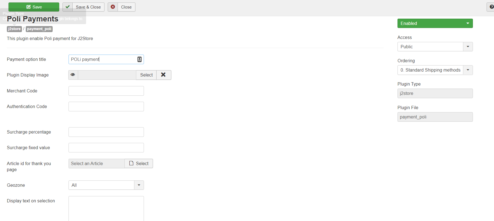

# Poli Payment Plugin

POLi Payments (formerly known as Centricom) is one of the leading online payment system that is used by merchants and consumers in Australia and New Zealand.

Your customers no longer need to have a credit or debit card when shopping online at your store or paying a bill.  POLi allows them to make a payment for purchases, or pay a bill using money straight from their bank account. A benefit is that the merchant receives an instant receipt allowing them to provide the goods or services to the customer immediately. Consumers do not have to register to use POLi.

The plugin implements the new REST API of the POLi to ensure smooth and secure payments for your goods and services. More information about POLi Payments can be obtained from their [website](http://www.polipay.co.nz/)

## Requirements

1. PHP version 5.4 or higher
2. Joomla 3.x and above
3. J2Store 3.2.7 +

## Installation 

1. Download Poli payment plugin package from our site’s extensions section and install it using Joomla installer.
2.  After installing plugin, go to J2Store > Setup > Payment methods and enable Poli

    for J2Store.
3. Once enabled, open / edit the plugin and configure the basic settings of the app.

## Configuration 

**Payment option title:** You may enter the title of the payment method you wish to display at the frontend in checkout here. If left blank, the default payment text will be displayed.

**Plugin Display Image:** You may consider adding an image for the payment method to be listed in the checkout page next to the payment method in frontend.

**Merchant Code:** Please enter Merchant code associated with POLi account

**Authentication Code:** Please enter Authentication code associated with POLi account

**Surcharge percentage:** You may specify a percentage here. Surcharge will be calculated based on the percentage of the total order and the cost will be added to the order.

**Surcharge fixed value:** You can specify a value here. The fixed value will be added to order total.

**Article ID for Thankyou page:** This article is displayed after the payment is processed. It can include anything (including the plugins) and should at the very least tell your customer what to do next.

**Geozone:** You can restrict showing this payment method only to the customers who belong to the selected geozone. Choose All in order to display this payment option to all customers.

**Display Text on Selection:** The text entered here will be displayed when customer selects this payment method. You can enter a language constant as a value here if you are using a multi-lingual site and then write a language override. Refer the tips below.

**Tip - ONLY FOR MULTI-LINGUAL SITES**

For example, enter a language constant:

J2STORE\__TEXT\__TO\__DISPLAY\__ON\_SELECTION

Now you can go to Joomla admin-> Language Manager->Overrides and create overrides for the language constant in all your languages.

**Display Text before Payment:** The text entered here will be displayed to the customer at the order summary screen before he makes the payment. You can enter a language constant as a value here if you are using a multi-lingual site and then write a language override. Refer the Display text on selection parameter.

**Display Text after Payment:** The text entered here will be displayed to the customer after he makes the payment. You can enter a language constant as a value here if you are using a multi-lingual site and then write a language override. Refer the Display text on selection parameter.

**Display Text on Error in Payment:** The text entered here will be displayed to the customer when there is an error in the payment process. You can enter a language constant as a value here if you are using a multi-lingual site and then write a language override. Refer the Display text on selection parameter.

**Display Text if customer Cancels Payment:** The text entered here will be displayed to the customer when he cancels the payment at the gateway (NOT in your site). You can enter a language constant as a value here if you are using a multi-lingual site and then write a language override. Refer the Display text on selection parameter.

**Payment Button Text:** The text of the payment button. The button will be displayed at the final checkout step.

**DEBUG :** This option is chosen in order to enable or disable the display of log file. This should be in disable for live sites.

Thus, once you have mentioned the necessary details for the above parameters, you are ready to receive payments via POLi on your store.

\
