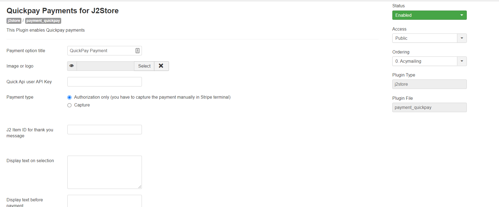
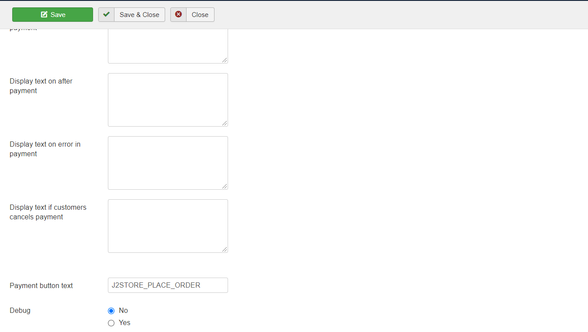

# QuickPay

QuickPay enables you to accept a wide range of payment methods, including credit card and bank transfer securely. QuickPay operates at the highest level of security and is certified by the PCI Security Standards Council. You can feel safe with us and your customers safe with you. More information can be found at the [QuickPay](https://quickpay.net/) website.

The plugin uses the Payment Window method. Customers will be redirected to QuickPay where they will enter their card details or initiate a wire transfer. This ensures a highest level of security as QuickPay handles the credit card information and other sensitive data in its website. You do not need an SSL certificate to use the QuickPay plugin.\

## Requirements

1. PHP version 5.4 or higher
2. Joomla 3.x and above
3. J2Store 3.2.7 +

## Installation 

1. Download QuickPay payment plugin package from our site’s extensions section and install it using Joomla installer.
2.  After installing plugin, go to J2Store > Setup > Payment methods and enable QuickPay

    for J2Store.
3. Once enabled, open / edit the plugin and configure the basic settings of the app.

## Configuration 

**Payment option title:** You may enter the title of the payment method you wish to display at the frontend in checkout here. If left blank, the default payment text will be displayed.

**Image or logo:** You may consider adding an image for the payment method to be listed in the checkout page next to the payment method in frontend.

**Quick API user API key:** Enter the API key associated with your QuickPay account.

**Payment Type:** Select the payment type for your payment here.                                                                                  **Authorization only (you have to capture manually in stripe terminal):** If the user amount do not transfer to merchant account, But then the User allows amount transfer. Merchant have to accept amount transfer in payment account, to achieve this requirement you have to set payment type as Authorize.                                                                                                                                                               **Capture:** If you wish the User amount to immediately be transferred to merchant account.

**J2 Item ID for thankyou message:** This article is displayed after the payment is processed. It can include anything (including the plugins) and should at the very least tell your customer what to do next.

**Display Text on Selection:** The text entered here will be displayed when customer selects this payment method. You can enter a language constant as a value here if you are using a multi-lingual site and then write a language override. Refer the tips below.

**Tip - ONLY FOR MULTI-LINGUAL SITES**

For example, enter a language constant:

J2STORE\__TEXT\__TO\__DISPLAY\__ON\_SELECTION

Now you can go to Joomla admin-> Language Manager->Overrides and create overrides for the language constant in all your languages.

**Display Text before Payment:** The text entered here will be displayed to the customer at the order summary screen before he makes the payment. You can enter a language constant as a value here if you are using a multi-lingual site and then write a language override. Refer the Display text on selection parameter.

**Display Text after Payment:** The text entered here will be displayed to the customer after he makes the payment. You can enter a language constant as a value here if you are using a multi-lingual site and then write a language override. Refer the Display text on selection parameter.

**Display Text on Error in Payment:** The text entered here will be displayed to the customer when there is an error in the payment process. You can enter a language constant as a value here if you are using a multi-lingual site and then write a language override. Refer the Display text on selection parameter.

**Display Text on Cancel Payment:** The text entered here will be displayed to the customer when he cancels the payment at the gateway (NOT in your site). You can enter a language constant as a value here if you are using a multi-lingual site and then write a language override. Refer the Display text on selection parameter.

**Payment Button Text:** The text of the payment button. The button will be displayed at the final checkout step.

**DEBUG :** This option is chosen in order to enable or disable the display of log file. This should be in disable for live sites.

Thus, once you have mentioned the necessary details for the above parameters, you are ready to receive payments via QuickPay on your store.

