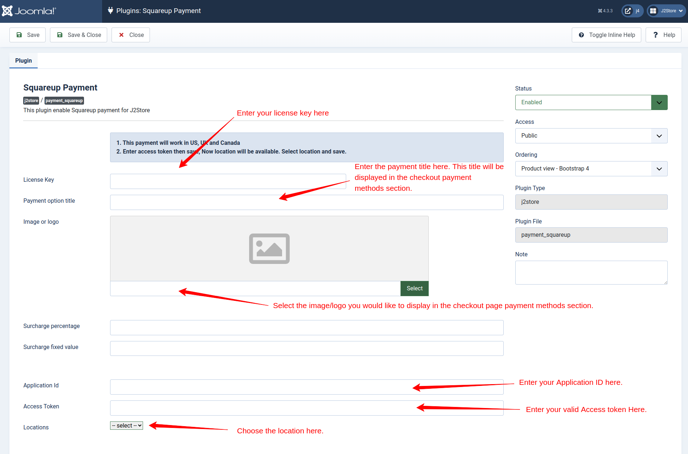

# Squareup Payments

This plugin integrates Square API with J2Store Joomla eCommerce solution. Our plugin accept all major credit cards with J2Store. The Square API provides a secure form for the customers to enter the card details. If you are already using Square POS for your offline store, then this plugin will help you use accept payments in your online store. Thus your payments are kept in one gateway.

Square eCommerce payments is only available in the US and Canada

Your website should have SSL enabled (https). Its a requirement enforced by Square

The plugin ONLY implements the payments API of Square. That means it does not sync inventory between your Offline POS and the Online store.

**Requirements**

1. PHP 5.4 or higher
2. Joomla 4.0.0 or the latest version.
3. J2Store4 4.0.2-PRO
4. SSL Certificate

**Installation**

1. Download our Squareup payment plugin from our site and install it using Joomla installer.
2. After installing plugin, go to J2Store > Setup > Payment methods and enable Squareup Payment.
3. Once enabled, open the payment plugin and configure the basic settings of the payment plugin.

**Where to find your Application ID and Access token for your sandbox account ?**

1. Log into Squareup application dashboardhttps://connect.squareup.com/apps”target = ¨\_blank”rel = ¨noopener¨> click here
2. If you don’t have any existing application, click on New Application to create new application.

1. If applications exists, Click the application you want sandbox credentials for, then refer to the Sandbox section at the bottom.

1. Copy the application ID and access token and paste them in our Squareup payments plugin configuration page.

**Configuration**

**Licence key** \
\
Enter your license key here to receive upcoming updates for the plugin.\
\
**Payment option title** Enter the payment title here. Title entered here will be displayed at checkout payment methods section. If you leave this empty, default payment title Squareup Payment will be displayed.

**Image or logo** Add logo image for your payment option here. Image added here will be displayed at checkout payment methods section.

**Application ID** Enter the Application ID associated with your Squareup payment account.

**Access Token** Enter the Access token associated with your Squareup payment account. Once entered Application ID and Access Token, save. After saving, the Location parameter will show the list of locations available.

**Locations** Choose your desired location from the available list and save.

**Sandbox / Test mode** Squareup payment offers you the sandbox feature to test your store in test mode. Choose YES to use Squareup payments in test mode.

**Sandbox Application ID** If you are using Squareup in test mode, enter the Application ID of your Squareup’s test account.

**Sandbox Access Token** Enter the Access Token of your Squareup’s test account.

**Sandbox Locations** Once you entered your test account’s credentials, save. The location will be available. Choose the location from available list and save.

**Article ID for custom thanks message** You can create a Joomla Article to say thanks to the users, who purchased in your online store. Enter the article ID here.

**Geozone** By selecting a geozone here, you can restrict this payment method to only customers of that Geo-region. Choose All geozones to show this method to all customers.

**Display text on selection** The text entered here will be displayed when customer selects this payment method. You can enter a language constant as a value here if you are using a multi-lingual site and then write a language override. For example, enter a language constant:

J2STORE_TEXT_TO_DISPLAY_ON\_SELECTION.

Now you can go to Joomla admin-> Language Manager->Overrides and create overrides for the language constant in all your languages.

&#x20;

**Display text before payment** The text entered here will be displayed to the customer at the order summary screen before he makes the payment. You can enter a language constant as a value here if you are using a multi-lingual site and then write a language override. Refer the Display text on selection parameter.

**Display text on after payment** The text entered here will be displayed when customer completes the payment. You can enter a language constant as a value here if you are using a multi-lingual site and then write a language override. Refer the Display text on selection parameter.

**Display text on error in payment** The text entered here will be displayed to the customer when there is an error in the payment process. You can enter a language constant as a value here if you are using a multi-lingual site and then write a language override. Refer the Display text on selection parameter.

**Payment button text** Text entered here will be added as the name of the payment button. You can enter a language constant as a value here if you are using a multi-lingual site and then write a language override.

**Debug** Choose YES to enable the debug mode. If you set this to yes, then debug messages will be logged and saved in the cache folder in your Joomla root directory. DO NOT select YES in the live site.

