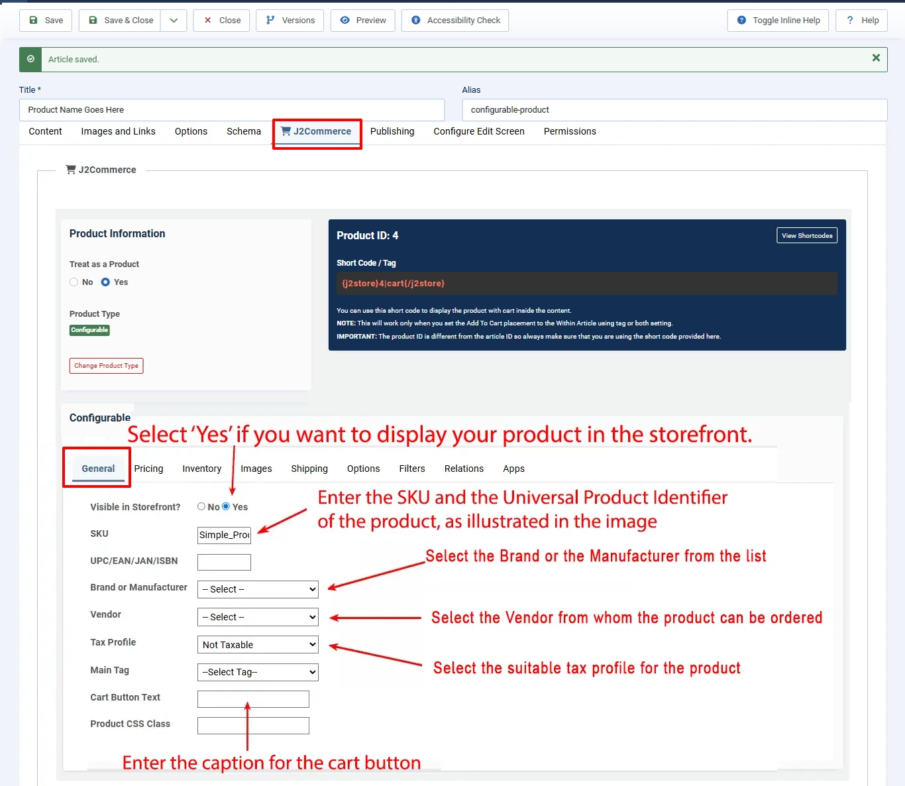
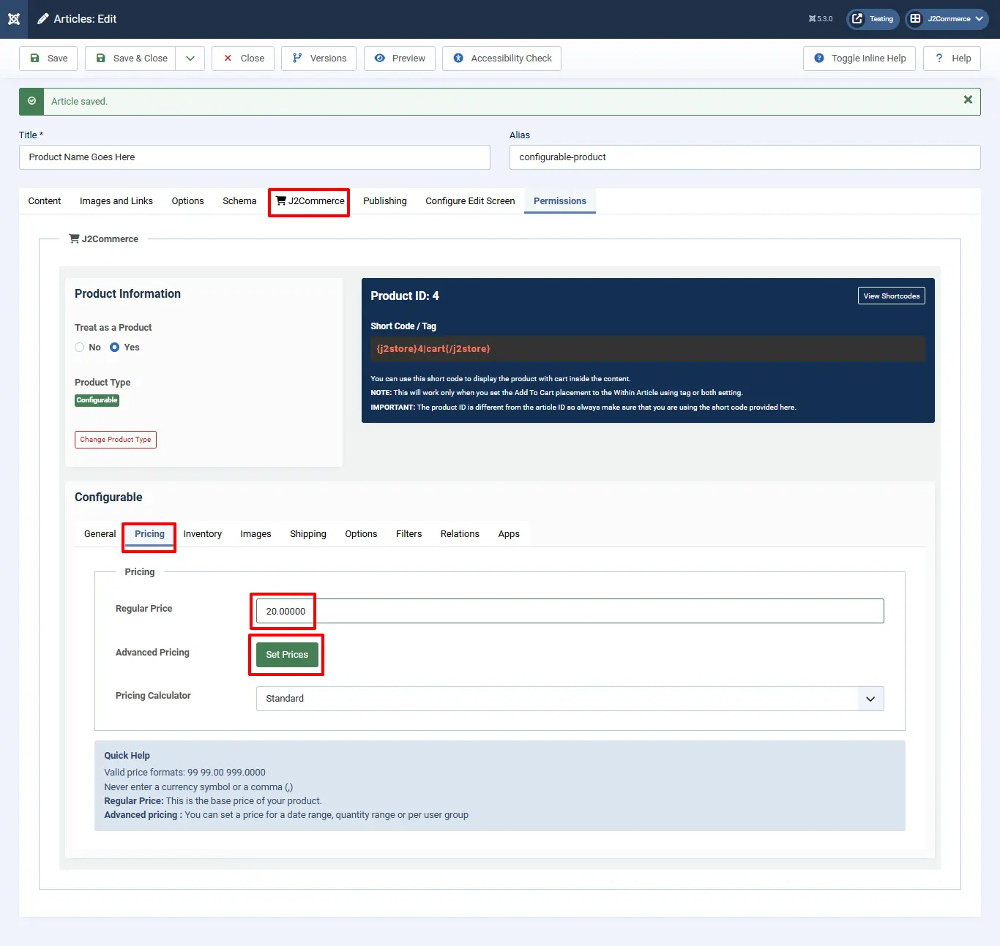
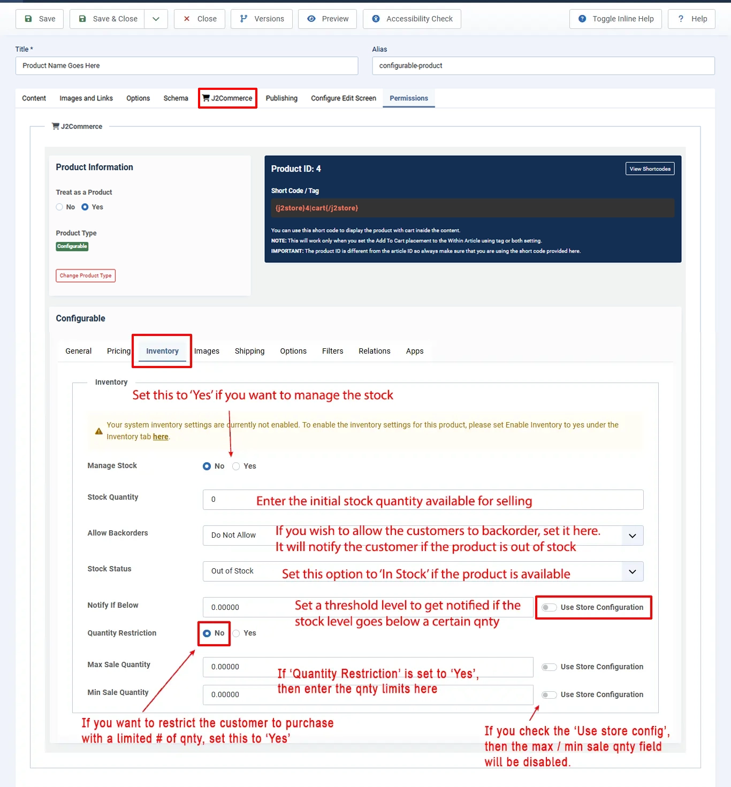
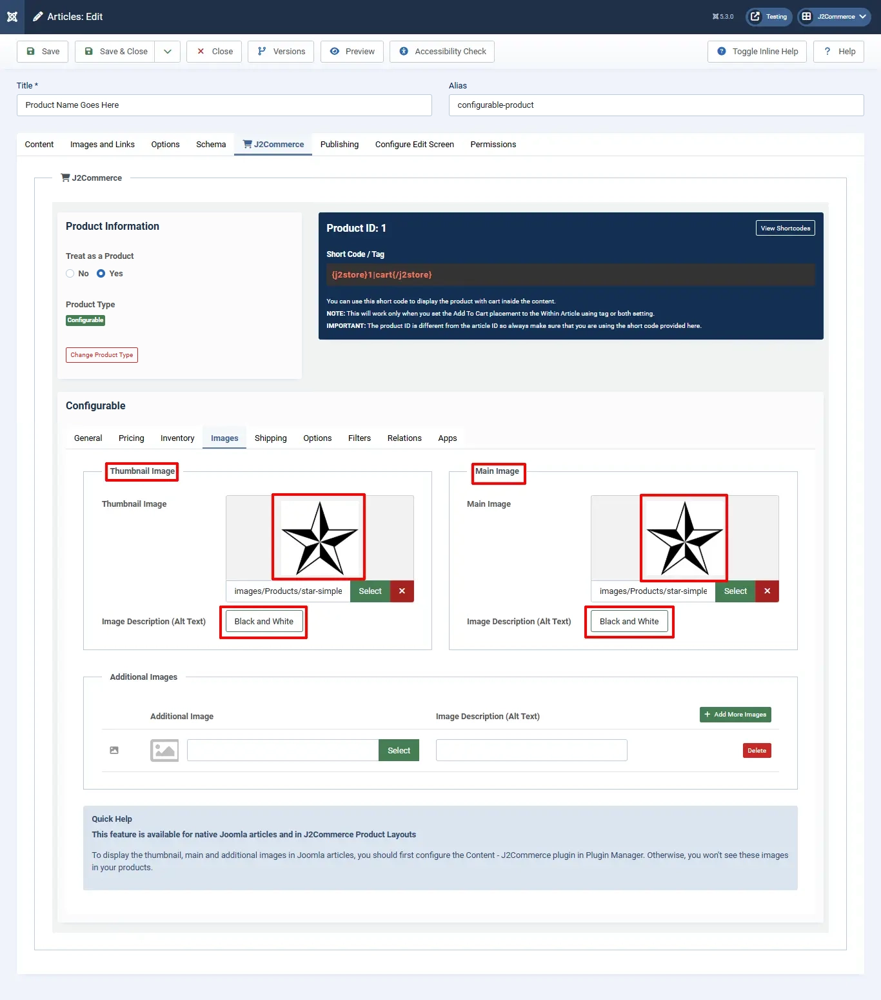
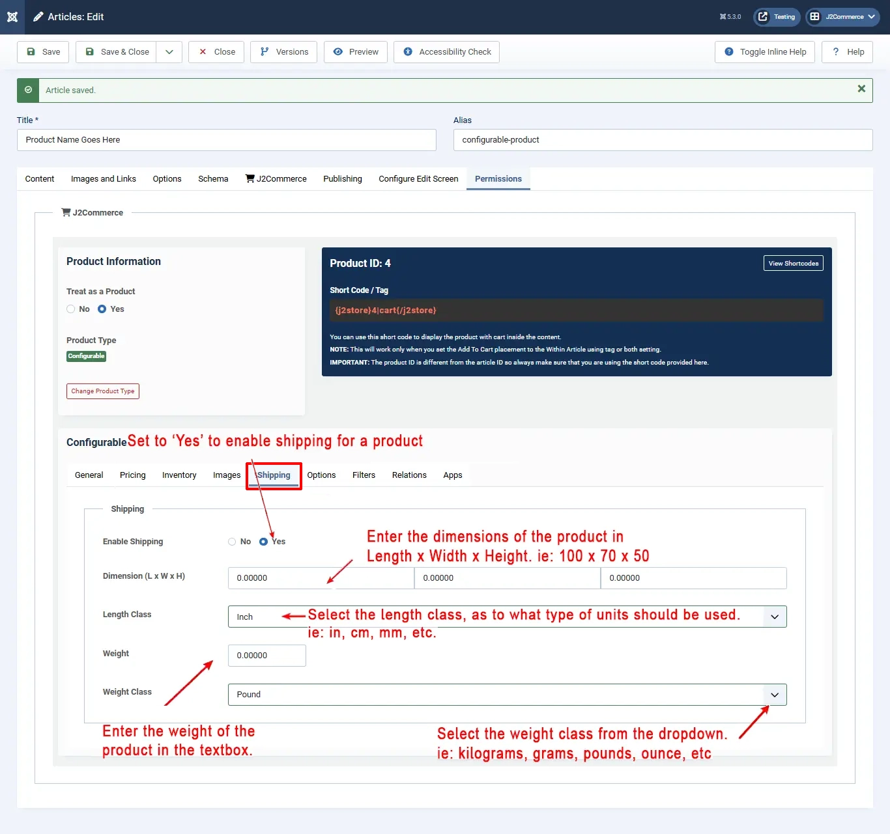
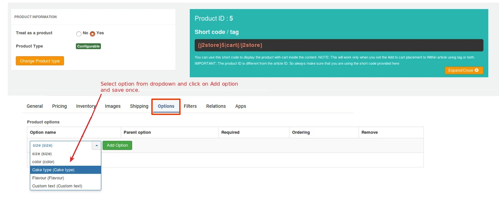
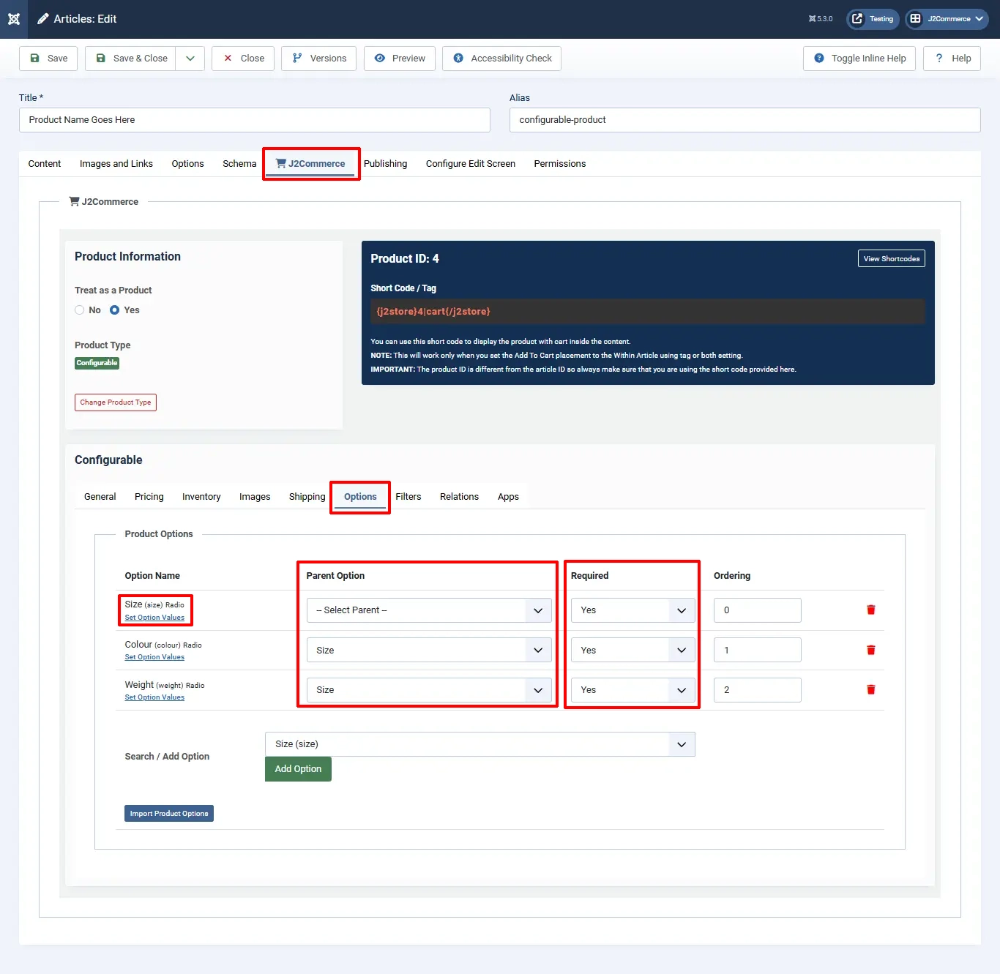
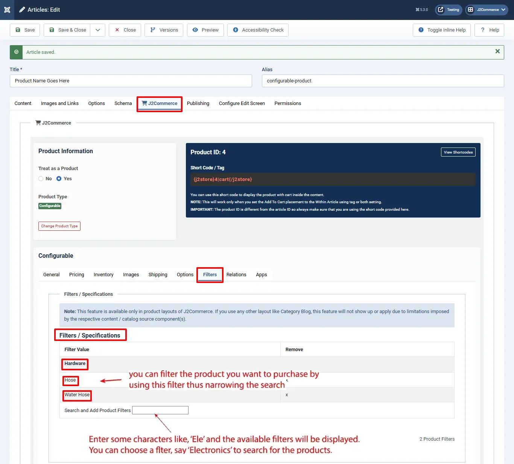
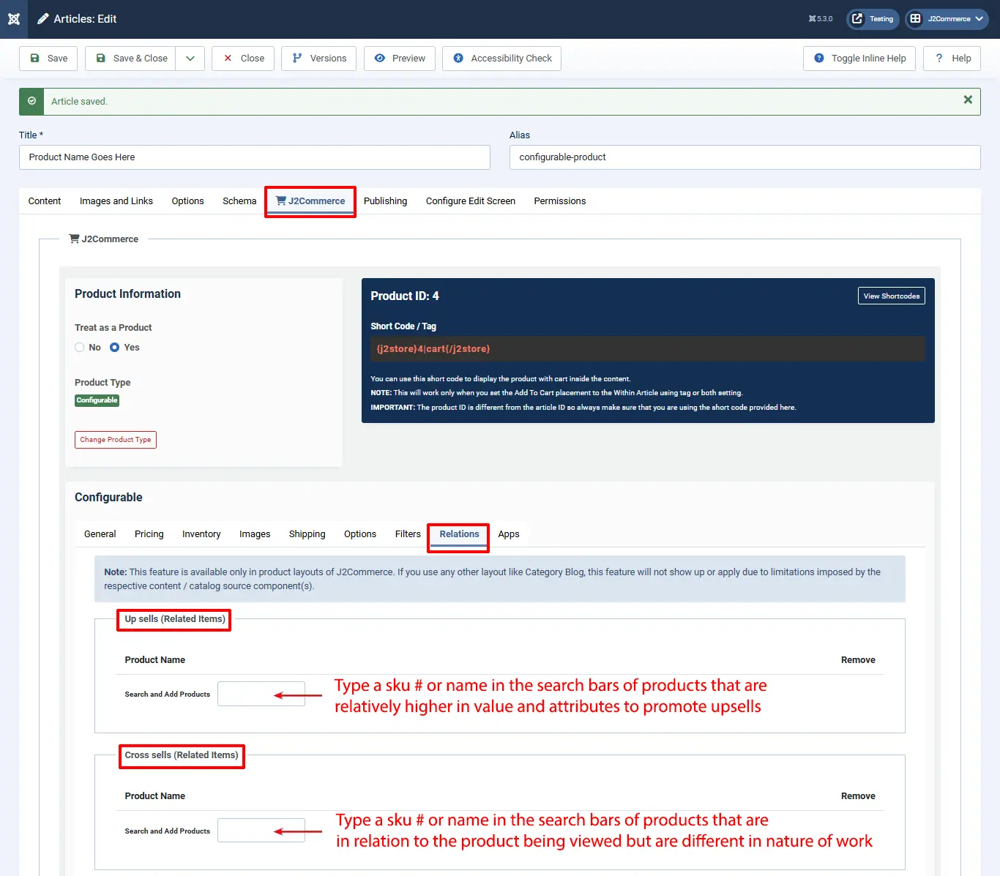

# Configurable product

## Introduction 

As the name suggests, you can allow customers to configure before adding the product to cart. This product type offers dependant / chained product options. That is you can define parent-child relationship between options.

Think of a visiting card. Customer will be asked first to select the type of paper first. Depending on his selection, subsequent options like colour will appear.

Start by creating a 'New' Article. Go to Content > Article > New.

Name your product and then go to the J2Commerce (J2Store Cart) tab. Select 'Yes' to Treat as a Product and in the dropdown menu select 'Configurable'

See image below

.webp>)

The settings for this product are exactly similar to that of simple product except in the options tab, where there is an additional field **Parent Option** is available to select a parent option. In the options listed, for all options, except first one, a parent option can be selected.

### General 

The general tab has several fields, in which we need to enter the necessary and relevant details, attached with the product.

Have a look at the image below:

* t.
* **Visible in Storefront:** \* **IMPORTANT**: Set this to YES if you want this product to be shown in the storefront.
* **SKU:** Enter the SKU number of the product
* **UPC/EAN/JAN/ISBN:** Enter UPC/EAN/JAN/ISBN code for the product, whichever is relevant. UPC - Universal Product Code (In US/North America) EAN - European Article Number (Outside North America/Europe) JAN - Japanese Article Number (Only in Japan) ISBN - International Standard Book Number (Globally) MPN - Manufacturer Part Number (Globally)
* **Brand or Manufacturer:** Select the brand or manufacturer of the product from the available list
* **Vendor:** Select the vendor from whom the product is available for purchase. Note: This feature is available in J2Commerce PRO version only
* **Tax Profile:** Specify whether the product is taxable, and if so, select the tax profile relevant to the product
* **Main Tag:** The tag selected here will be used for the canonical URL. More details about the canonical URL can be found [here](http://docs.j2store.org/canonical-url-plugin)
* **Cart Button Text:** Enter the text to be displayed in the cart button
* **Product CSS class:** Use this option to add a unique CSS class to each product.

### Pricing 

Add the price of your product. Depending on your requirements, you can also choose to configure an advanced pricing plan from here.

Now, check the image below:

As illustrated in the image, you can set the regular price by entering the value in the text box. If you want advanced pricing, which is special pricing for certain groups ie: VIPs, Managers, Developers, Schools, etc., click the ’**Set Prices**’ button and it will open up a pop-up window to allow you to set an advanced price setting.

Leave the date range blank if you want that specific group to awlays receive the special pricing.&#x20;

Check the image below:

* First, select the dates between which you wish to set the advanced price.
* Then enter the minimum quantity required to avail this special price. This is optional, and if there is no minimum quantity required, just leave it empty.
* Select the customer group to which you offer this special price.
* Now enter the new price and click Create.

The price will be added and displayed below. You can edit that if you need, and click **Save all prices**. If you want to remove that, you can do it by clicking the **Remove** button.

### Inventory 

* This is J2Commerce PRO exclusive feature \*

This tab has the configuration setup facility for inventory management. Here you can set the following details with respect to inventory.&#x20;

Check the image below:

*

    From the image, you can understand the following:

    * **Manage Stock:** To enable Stock Management, select 'Yes'
    * **Stock Quantity:** Enter the initial stock quantity
    * **Allow Backorders:** Choose from the options whether or not to allow backorders to customers, i.e., the customer can order a product even if there is 'No stock allow but notify customers'. The second option would allow customers to purchase a product even if it is not in stock. A message will appear (a notification) before the price stating that: This item can be backordered.

    This comes from the language file. The constant is: J2COMMERCE\_BACKORDER\_NOTIFICATION

    You can write a language override for this constant and display a customized message.

    NOTE: This notification will display if:

    * Stock is 0

    This option is for those who sell fast-moving products. So even if a product stock reaches 0, the customers could still order.

    * **Stock Status:** Select stock status, i.e, In stock or Out of stock
    * **Notify if stock goes below:** Set minimum stock level for low stock alert
    * **Quantity Restriction:** Choose whether the purchase quantity is restricted, and if 'Yes', set the limits for minimum and maximum quantity for a purchase by entering the quantities in the fields provided
    * **Use store configuration:** If you select 'Use store configuration', you cannot enter the max and min quantity fields, as they will be disabled

### Video Tutorial: 



### Images 

In this tab, you can add images that can help the customer in a clearer understanding of the product he wants to buy. Images help the prospect to imagine what the product they intend to purchase will look like.

See the image below:

Let us understand this with an example.

Let's assume that a customer would like to purchase a pizza. You need pizza images to be loaded in this tab.

* **Main Image:** The main image will be a general photo image of the pizza, which has to be uploaded by clicking on the ‘Select an image’ button and selecting the appropriate image from the files.
* **Thumbnail Image:** The thumbnail image would be something that represents the original product, but it would be a much smaller one to fit into a button, which will be shown in the cart. By seeing this, the customer will understand that his product is displayed on the button and will click the button to see more details about the pizza.
* **Additional Images:** Additional images help the customer to know more details about the pizza, which will be showing the pizza view in many variations, with other add ons, and the customer will understand it clearly how it looks like, what are the add-ons available with the pizza, the prize, and so on.

The button with the caption, **Add more images**, when clicked, inserts a new row below the **Additional images** to select another image of the product.

### Shipping 

This tab has the configuration settings for shipping. Any product that has been purchased has to be shipped to the customer if the product is physically deliverable.

Consider the image below:

As shown in the image, you need to do the following activities to configure shipping:

* **Enable Shipping:** Select Yes to enable shipping
* **Dimensions:** Enter the dimensions of the packed product in Length x Width x Height
* **Length Class:** Choose a length class from the list e.g., cm, mm, inch, etc.
* **Weight:** Enter the net weight of the product when packed in the field provided
* **Weight Class:** Select the weight class from the list, like Kg, grams, pounds, etc.

This configuration will be loaded when shipping is selected.

### Options 

Pay close attention when you add options. Because you can configure the parent-child relationship between the options.&#x20;

Once you select the option from the dropdown list, it will be added, as you can see in the image below.

Now, save the image and your option will be saved. Now, you will get a link ’**Set option values**’ near the option name. Click this link to get a pop-up window, where you can set values specific to the newly created options.&#x20;

Let's use the example below. In this example, the product is a hose. The colors offered are red, White, and blue, and the sizes offered are 10', 20', and 30'.  The size is the parent attribute, and the other two attributes will be set based on the parent attribute.  The red hose comes in all three lengths, but the white and blue don't come in the smallest length. So, in this window, you will specify which combinations are offered so your shopper doesn't purchase something that isn't available.&#x20;

As shown below:&#x20;

### Filters 

Add filtering attributes so that your customers can quickly narrow down the search and find the right product.

For e.g., assume that a customer searches for Hoses in the store. Hose is classified in the Hardware category. So, the product filter is set to be Hardware > hose, to narrow the search. In the example below, There are multiple types of hoses in the filter section.

See the image below:

### Relations 

Relations are used to promote sales by suggesting to the customer higher value products than the one being looked at and additional products to be bought with a particular product.

* In this tab page, relations are set for Upsells and Cross-sells
* An upsell is to get the customer to spend more money – buy a more expensive model of the same type of product considered for purchase.
* A cross-sell is to get the customer to spend more money by adding more products from other categories, additionally, along with the product intended for purchase.
* Example: The terms cross-sell and upsell are often used interchangeably because, let’s face it, this gets confusing. Say the customer is viewing a plain water hose for $25.

You can suggest the customer with some options, so that the customer may be convinced to buy one of your options, thus promoting a higher sale for you.

* Water hose with shutoff valve-> $8 - Upsell, same product family, more expensive
* Water hose with UV protection -> $10 - Upsell, same product family, more expensive
* Hose Holder -> $15 - Cross-sell, related product, additional sell


