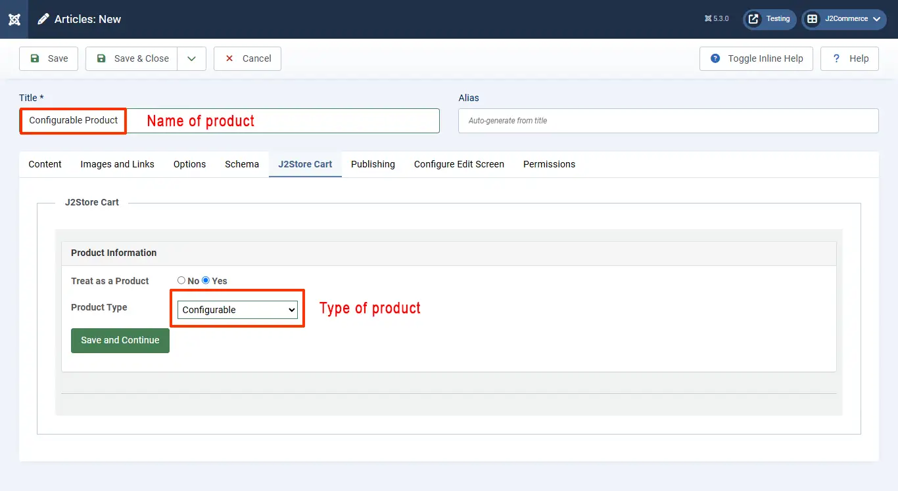
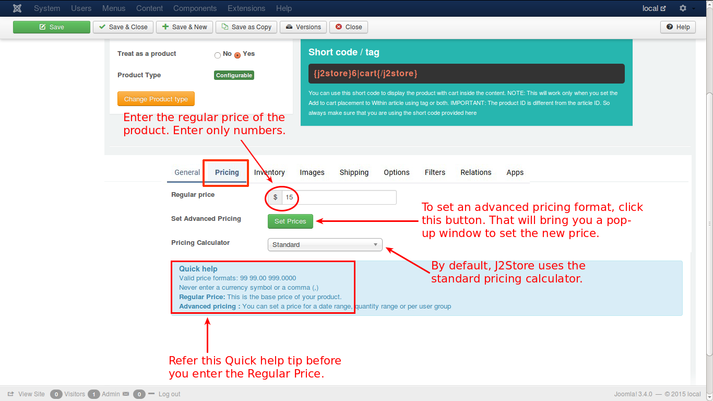
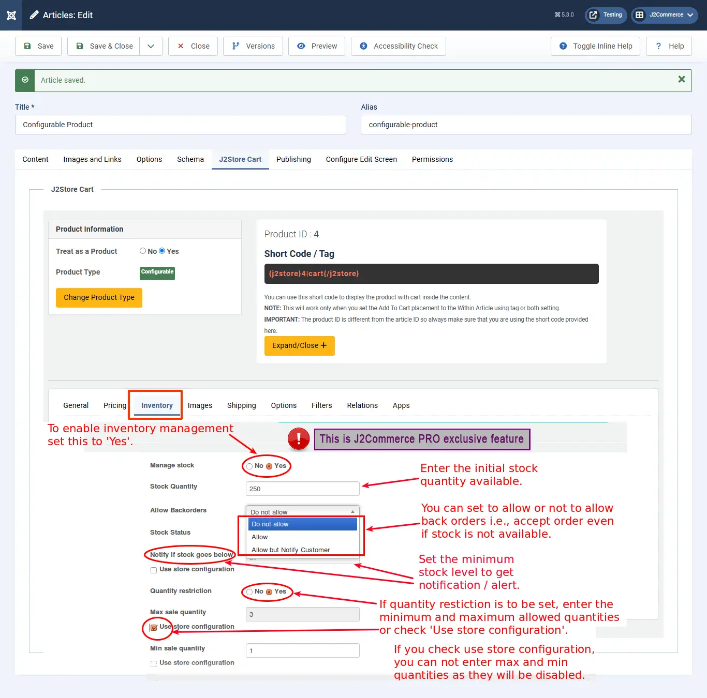
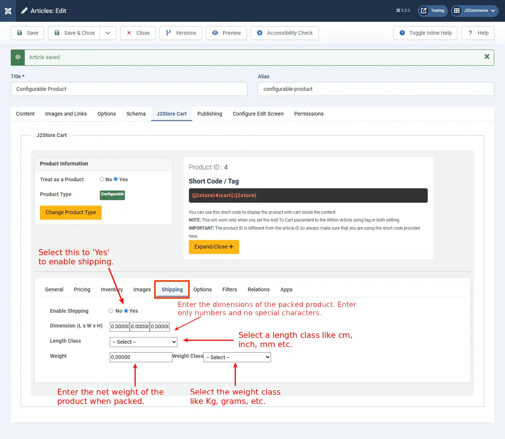
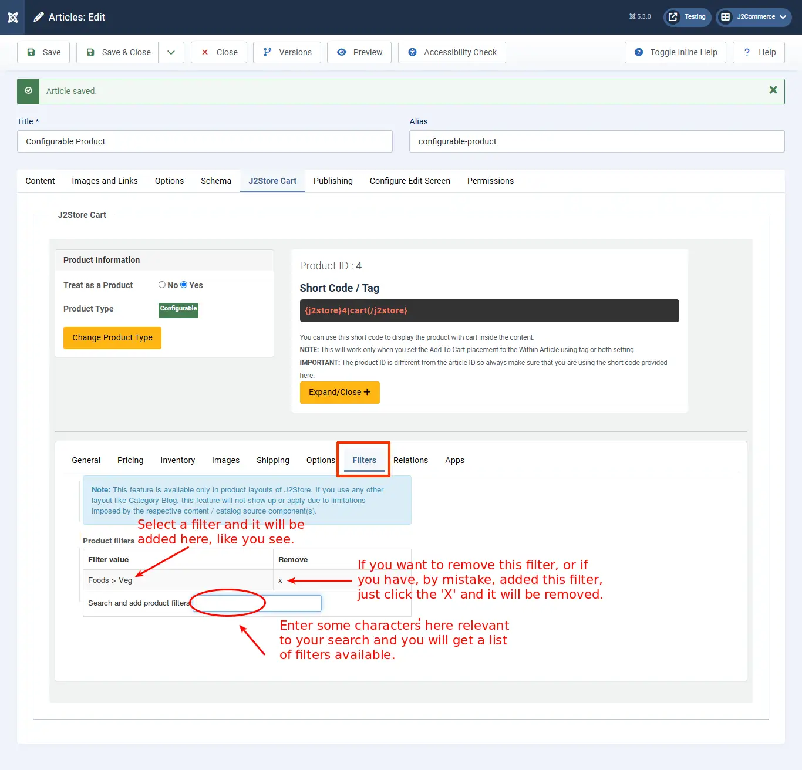
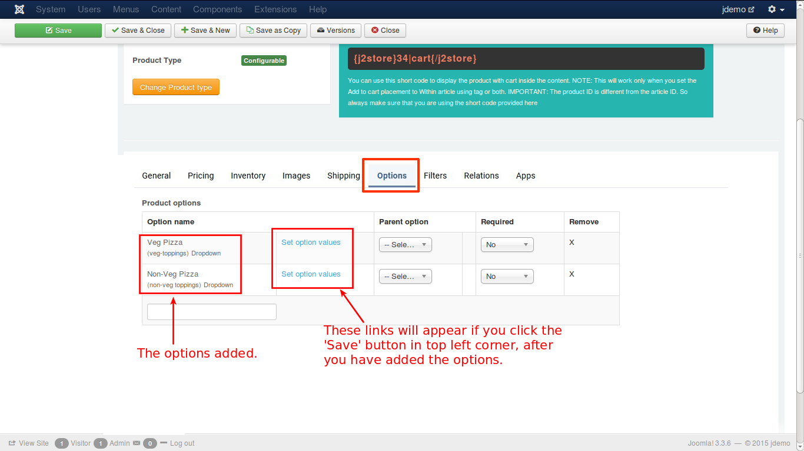
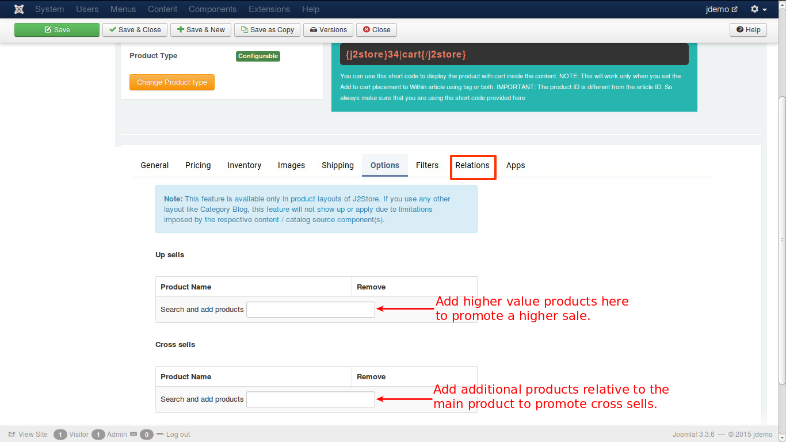
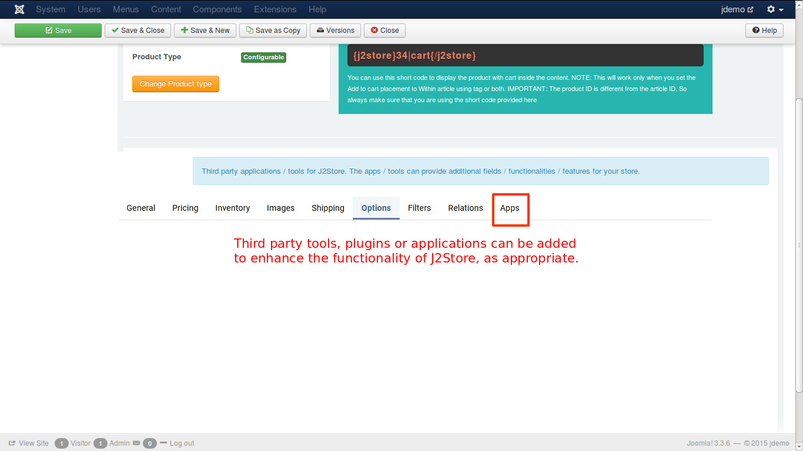

# Configurable product

## Introduction 

As the name suggests, you can allow customers to configure before adding the product to cart. This product type offers dependant / chained product options. That is you can define parent-child relationship between options.

Think of a visiting card. Customer will be asked first to select the type of paper first. Depending on his selection, subsequent options like colour will appear.

The settings for this product are exactly similar to that of simple product except in the options tab, where there is an additional field **Parent Option** is available to select a parent option. In the options listed, for all options, except first one, a parent option can be selected.

### General 

.webp>)

* Visible in Storefront: First select whether the product is to be displayed in front of the store and this is a mandatory option to be selected
* SKU: Enter the SKU number of the product
* UPC/EAN/JAN/ISBN: Enter UPC/EAN/JAN/ISBN code for the product whichever is relevantUPC - Universal Product Code (In US/North America) EAN - European Article Number (Outside North America/Europe)JAN - Japanese Article Number (Only in Japan)ISBN - International Standard Book Number (Globally) MPN - Manufacturer Part Number (Globally)
* Brand or Manufacturer: Select the brand or manufacturer of the product from the available list
* Vendor: Select the vendor from whom the product is available for purchase - Note: This feature is available in J2Commerce PRO version only
* Tax Profile: Specify whether the product is taxable, and if s,o select the tax profile relevant to the product
* Main Tag: The tag selected here will be used for the canonical URL. More details about the canonical URL can be found here [click here](https://docs.j2store.org/catalog/\[http://docs.j2store.org/canonical-url-plugin]\(%3Chttp:/docs.j2store.org/canonical-url-plugin%3E\))
* Cart Button Text - Enter the text to be displayed in the cart button.
* Product CSS class - Use this option to add a unique CSS class to each product.

### Pricing 

The pricing section will guide you to understand how to set regular pricing and advanced pricing for a product. Consider the image below:

As illustrated in the image, you can set the regular price by entering the value in the text box. If you want advanced pricing, click the ’**Set Prices**’ button and it will open up a pop-up window to allow you to set an advanced price setting.

Let us see how it happens. Check the image below:

* First, select the dates between which you wish to set the advanced price.
* Then enter the minimum quantity required to avail this special price. This is optional, and if there is no minimum quantity required, just leave it empty.
* Select the customer group to which you offer this special price.
* Now enter the new price and click Create.

The price will be added and displayed below. You can edit that if you need, and click **Save all prices**. If you want to remove that, you can do it by clicking the **Remove** button.

### Inventory 

**This is J2Commerce PRO exclusive feature**

* Manage Stock - To enable Stock Management, Select Yes
* Stock Quantity - Enter the initial stock quantity
* Allow Backorders - Choose from the options whether or not to allow backorders to customers, i.e., the customer can order a product even if there is No Stock Allow but notify customers - The second option would allow customers to purchase a product even if it is not in stock. A message will appear (a notification) before the price stating that: This item can be backordered

This comes from the language file. The constant is: J2STORE\_BACKORDER\_NOTIFICATION

You can write a language override for this constant and display a customized message.

NOTE: This notification will display if:

* Stock is 0

This option is for those who sell fast-moving products. So even if a product stock reaches 0, the customers could still order.

* Stock Status - Select stock status i.e., In stock or Out of stock
* Notify if stock goes below - Set minimum stock level for low stock alert
* Quantity Restriction - Choose whether the purchase quantity is restricted, and if Yes, set the limits for minimum and maximum quantity for a purchase by entering the quantities in the fields provided
* Use store configuration - If you select ‘Use store configuration’, you cannot enter the max and min quantity fields, as they will be disabled

### Video Tutorial: 



### Images 

In this tab, you can add images that can help the customer in a clearer understanding of the product he wants to buy. Images help the prospect to imagine what the product intend to purchase will look like.

See the image below:

Let us understand this with an example.

Let's assume that a customer would like to purchase a pizza. You need pizza images to be loaded in this tab.

* Main Image: The main image will be a general photo image of the pizza, which has to be uploaded by clicking on the ‘Select an image’ button and selecting the appropriate image from the files.
* Thumbnail Image: The thumbnail image would be something that represents the original product, but it would be a much smaller one to fit into a button, which will be shown in the cart. By seeing this, the customer will understand that his product is displayed on the button and will click the button to see more details about the pizza.
* Additional Images: Additional images help the customer to know more details about the pizza, which will be showing the pizza view in many variations, with other add ons, and the customer will understand it clearly how it looks like, what are the add-ons available with the pizza, the prize, and so on.

The button with the caption, **Add more images**, when clicked, inserts a new row below the **Additional images** to select another image of the product.

### Shipping 

As shown in the image, you need to do the following activities to configure shipping:

* Enable Shipping: Select Yes to enable shipping
* Dimensions: Enter the dimensions of the packed product in Length x Width x Height
* Length Class: Choose a length class from the list e.g., cm, mm, inch, etc.
* Weight: Enter the net weight of the product when packed in the field provided
* Weight Class: Select the weight class from the list like Kg, grams, pounds, etc.

This configuration will be loaded when shipping is selected.

### Options 

Pay close attention when you add options. Because you can configure the parent-child relationship between the options.

Once you select the option from the dropdown list, it will be added, as you can see in the image below.

Now, save the image and your option will be saved. Now, you will get a link ’**Set option values**’ near the option name. Click this link to get a pop-up window, where you can set values specific to the newly created options. Here is how it happens, as shown below:

### Filters 

Add filtering attributes so that your customers can quickly narrow down the search and find the right product.

For e.g., assume that a customer searches for vegetarian pizza in the store. Pizza is classified in food category. So, the product filter is set to be Foods > Veg, to narrow the search. See the image below:

### Relations 

Relations are used to promote sales by suggesting to the customer higher value products than the one being looked at and additional products to be bought with a particular product.

* In this tab page, relations are set for Upsells and Cross-sells
* An upsell is to get the customer to spend more money – buy a more expensive model of the same type of product considered for purchase.
* A cross-sell is to get the customer to spend more money by adding more products from other categories, additionally, along with the product intended for purchase.
* Example: The terms cross-sell and upsell are often used interchangeably because, let’s face it, this gets confusing. Say the customer is viewing a plain veg pizza for $5.

You can suggest the customer with some options, so that the customer may be convinced to buy one of your options, thus promoting a higher sale for you.

* Veg Pizza with capsicum -> $8 - Upsell, same product family, more expensive
* Veg Pizza with paneer butter -> $10 - Upsell, same product family, more expensive
* Beverages/Ice cream -> $3 - Cross-sell, related product, additional sell

## A step-by-step example to create a configurable product 

**J2Commerce** implements an innovative concept in creating products. It uses the Joomla articles as products. So, to create a product is to create an article.

So, let's create an article.

### Creating an Article 

Have a look at the image below:

As given in the above illustration, click in the top menu or in the left pane of the control panel. You will get a new screen like this.

A configurable product is one that can be configured by the customer who intends to purchase the product. A suitable example is Pizza. This basic pizza is displayed as a configurable product, and the user is allowed to add toppings over the basic product. The price of the product will be changing according to the toppings added by the customer. Follow the steps to create a configurable product.

* Enter the name of your product.
* Since you are creating an article, you need to tell that the article should be treated as a product. So, select ‘Yes’.
* Select the type of product, i.e., ‘Configurable’.
* Now, click the ‘Save and Continue’ button.

Your product is successfully created, and a message will be displayed like this.

.webp>)

You can enter the description of your product as shown below:

### General 

Now you need to configure your product with the necessary details. Begin with the general tab. See the image below:

.webp>)

Enter the details as required by the fields in the tab, like SKU, UPC/EAN, brand, vendor, tax profile, and the caption for the cart button. Once you enter them, navigate to the next tab, pricing.

### Pricing 

In Pricing, you can set the price for your product. You have the option to set up advanced prices, like discount offers, as shown in the following images.

In the above image, you set up the regular price for the basic pizza. Click the set prices button to set advanced/special prices. It will pop up a window to set the special prices.

Check the image below:

In the above image, you can set a date range for the special price, otherwise, you can leave it empty for the special price to be applied always. For example, if a customer buys 5 or more pieces of pizza, you can offer a discount on the price throughout the year. Now, you have entered the values, and click the blue ‘Create’ button, and you will get the special price listed below, as shown in the image.

### Inventory 

Now, configure the Inventory tab.

In this tab, you set the initial stock, whether or not to allow backorders(order placement even if stock is not available), low stock alert quantity, purchase quantity restriction for any customer etc.

Check the image below:

.webp>)

**Images**

Now, add relevant images for your product display in the cart. Here is how it can be done.

.webp>)

When you click on the ‘select an image’ button, you will see a pop-up window where you can select the image for your product.

### Shipping 

Move on to the shipping tab. Here, you set up the shipping configuration for the product. Enter the dimensions, a class for dimensions,the  weight of the product, and its class. All in packed condition.

Check the image below.

.webp>)

Next is the options tab.

### Options 

In this tab, you empower the customer to configure the product. See how it is…

.webp>)

When you type the characters, the available options will be listed, and you can select one from the list. The options are selected and added to the tab, as shown in the image below.

.webp>)

Now, click only the green colored ‘Save’ button in the top left corner to get these options saved, and a link will appear near the options as shown below.

Click on the link now to set values for the options.

Now, go to filtes tab.

### Filters 

The filters will help to narrow the product search for specific products. For e.g., if you add a filter with the value ‘Veg’, the search will display only veg pizzas.

.webp>)

### Relations 

The next tab is Relations. Here, you can add products of higher value than the one being viewed by the customer and recommend that the customer buy that product, citing its advantages and additional features. This is an upsell.

Refer to the image below:

Also, you can add some other products to convince the customer to buy those products additionally. This is cross-selling.

For a more detailed explanation, refer to the **Relations** section of the **Configurable Product**.

### Apps 

In this tab, you can add third-party tools or plugins that are available to enhance the J2Store functionality, like adding additional fields, applications, functions, or features.

Now, let's have a look at how your product is viewed in your online store. Check the image below:

### Video Tutorial: 

The following video illustrates how a configured product could be created:


