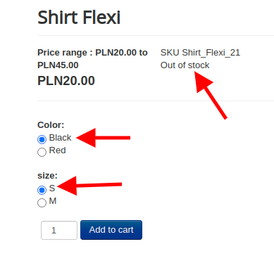
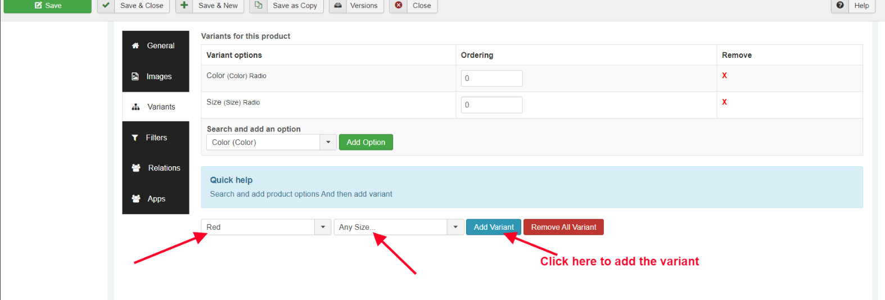
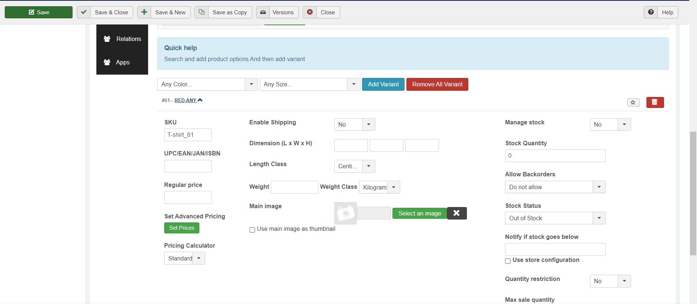
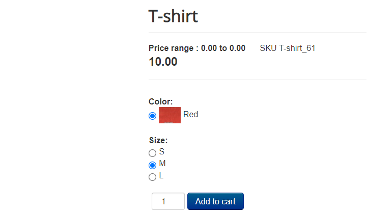

# Flexible variable product

Flexible Variable is an another new product type that we came up with . It is similar to variable product type but it has quiet different feature when compare to variable product type.

Like variable product type, it also lets you define variations of a product where each variant may have a different attributes, e.g. SKU, price and stock level.

The only different is that this product type does not generate variants automatically. The variant has to be generated manually by clicking on **Add variant** button. So that store owner could remove / delete the variant that has zero stock available and add variant once it is available.

Since adding / removing a single variant will be possible with this product type, it will be more easy for you manage variants which are out of stock.

## How to create FlexiVariable Product:

Start by creating a 'New' Article. Go to Content > Article > New.

Name your product and then go to the J2Commerce (J2Store Cart) tab. Select 'Yes' to Treat as a Product and in the dropdown menu select 'Flexible Variable'.

## General 

* Visible in Storefront - First select whether the product is to be displayed in front of the store. If it is, set the option to ‘Yes’
* Brand or Manufacturer - Select the brand or manufacturer of the product from the available list
* Vendor - Select the vendor from whom the product is available for purchase - This is J2Store PRO feature
* Tax Profile - Specify whether the product is taxable and if it is, select the taxprofile relevant to the product
* Cart button text - It allows you to define the custom text to be displayed in the add to cart button

This feature is available for native Joomla articles and in J2Commerce Product Layouts

To display the thumbnail, main, and additional images in Joomla articles, you should first configure the Content - J2Commerce plugin in the Plugin Manager. Otherwise, you won't see these images in your products.

Let's assume that a customer would like to purchase a car. Now, car images need to be loaded in this tab.

* Main Image - The main image will be a general photo image of the car, which has to be uploaded by clicking on the ‘Select an image’ button and selecting the appropriate image from the files.
* Thumbnail Image - The thumbnail image would be something that represents the original product, but it would be a much smaller one to fit into a button, which will be shown in the cart. By seeing this, the customer will understand that his product is displayed on the button and will click the button to see more details about the car.
* Additional Images - Additional images help the customer to know more details about the car, which will show the car view from many angles, and the customer will understand it clearly how it looks, what the technical details of the car are, the color, and so on.

**NOTE: For the images set for the variants to appear on the frontend, the main image and thumbnail image has to be set. Only then when the variants are chosen on the frontend their corresponding images would come up.**

## Variants 

Variants are products of the same type and nature but with different attributes. For e.g., consider a T-shirt of a particular brand with certain attributes, say

* Color - Blue
* Size - Large
* SKU - TSL001
* Price - $12
* Brand - Flying machine

and so on. This is a variant of the particular brand. Now, the same product with the same brand will be another variant with some attributes changed, like

* Color - Black
* Size - Small
* SKU - TSL002
* Price - $15
* Brand - Flying machine

For both items, a brand name may be the same, but the attributes like color, price, and SKU differ. These are two variants of a particular T-shirt brand.

* A variant defines how this product differs from other products of the same type
* It may be SKU no, price, stock level, or color

Let's discuss it with some image illustrations:

Select the size option from the dropdown list and then click on the Add option. The size will be added as a variant option.

And then choose the color option and add it to the variant options list in the same way.

After adding size and color, your screen will look like below:

Now you will get options to add variants to the product. Choose size from the drop-down “All sizes” and then choose the color and click on the **Add variant** button.

For example, select **L** from size and select **Black** from color, and click on the **Add variant** button. Likewise, add all the variants you want.

Now the screen will look like below:

If you want to edit the properties of the variants, open each variant by clicking on the small down arrow given next to the variant name. You will get the screen like below:

If any one of your variants comes **out of stock** and you want to hide that variant from displaying in frontend, you could do so by clicking on the delete icon.

Below is the screenshot of how the flexivariable product shows in the site’s frontend.

## Filters 

Filters are certain attributes that help narrow the search for a particular product.

For e.g., assume that a customer searches for purple t-shirts in the store. Now, the product filter is set as color > Black, to narrow the search. See the image below:

Now the cart will display only the Black t-shirts.

## Relations 

* In this tab page, relations are set for Upsells and Cross-sells
* An upsell is to get the customer to spend more money – buy a more expensive model of the same type of product considered for purchase.
* A cross-sell is to get the customer to spend more money by adding more products from other categories, additionally, along with the product intended for purchase.
* Example: The terms cross-sell and upsell are often used interchangeably because, let’s face it, this gets confusing. Say the customer is viewing a Laptop with 2GB/500GB for $500.4GB/500GB-> $550 - Upsell, same product family, more expensive4GB/1TB -> $700 - Upsell, same product family, more expensiveLaptop Bag -> $25 - Cross sell, related product, additional sale

## Apps 

Custom fields / settings from applications will be displayed in this tab.

## Video Tutorial 



#### Limitation:

The Flexi variable product comes with a set of limitations as follows:

* The availability of a particular variant combination cannot be previously determined, and the particular option cannot be hidden based on the option value chosen in the previous option.

**Example:** That is, if you have options like Color and Size, and if the size S is unavailable for Black color, then it is not possible to hide the option value S when the user chooses Black color.

Instead, when the user chooses black color and S size(which is unavailable), then there would be a message indicating that the particular variant is unavailable, as shown below:

## **How to set one variant with multiple variants:**

With the Flexivariable product type, you can sell a product of a particular variant that has the price and stock varying based on another variant.

**For Example,** let us consider you are selling a T-shirt of Color "Red" and that the Red color T-shirt has multiple sizes like Small, Medium and Large. So you would want the customer who chooses the Red color T-shirt to select the sizes from the frontend.

You can achieve this requirement with the Flexivariable product type by following the steps below:

#### Step:1

Create an Article under Content-Articles > New.

As given in the above illustration, click in the top menu or in the left pane of the control panel. You will get a new screen like this

* Enter the name of your product.
* Since you are creating an article, you need to tell that the article should be treated as a product. So, select ‘Yes’.
* Select the type of product, i.e., ‘FlexiVariable’.
* Now, click the ‘Save and Continue’ button.

Your product is successfully created, and a message will be displayed like this.

## General 

* **Visible in Storefront**: First, select whether the product is to be displayed in front of the store. If it is, set the option to ‘Yes’
* **Brand or Manufacturer**: Select the brand or manufacturer of the product from the available list
* **Vendor**: Select the vendor from whom the product is available for purchase - This is J2Commerce PRO feature
* **Tax Profile**: Specify whether the product is taxable, and if it is, select the tax profile relevant to the product
* **Cart button text**:- It allows you to define the custom text to be displayed in the add to cart button

## Variants

Variants are products of the same type and nature but with different attributes. For e.g., consider a T-shirt of a particular Color with certain Size attributes, say

* Color - RED
* Size - Small

This is a variant of the particular Color. Now, the same product with the same Colour, will be another variant with some attributes changed, like

* Color - RED
* Size - Large

For both items, Colour will be the same, but the attributes like Size differ. These are two variants of a particular T-shirt colour.

Let's discuss it with some image illustrations:

Select the Colour option from the dropdown list and then click on the Add option. The size will be added as a variant option.

And then choose the Size option and add it to the variant options list in the same way.

After adding color and size, your screen will look like below:

Now you will get options to add variants to the product. Choose Colour from the drop-down “Red” and then choose the Size as "Any Size" and click on the **Add variant** button.

Now the screen will look like below:

Below is the screenshot of how flexivariable product with one Color and various sizes would be displayed in the site’s frontend.

## &#x20;
