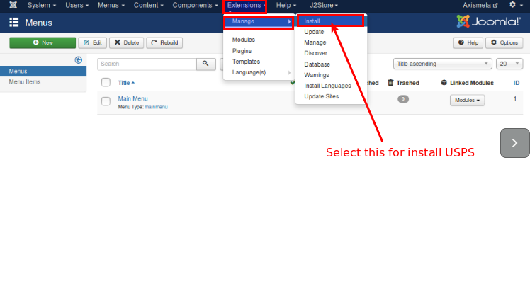
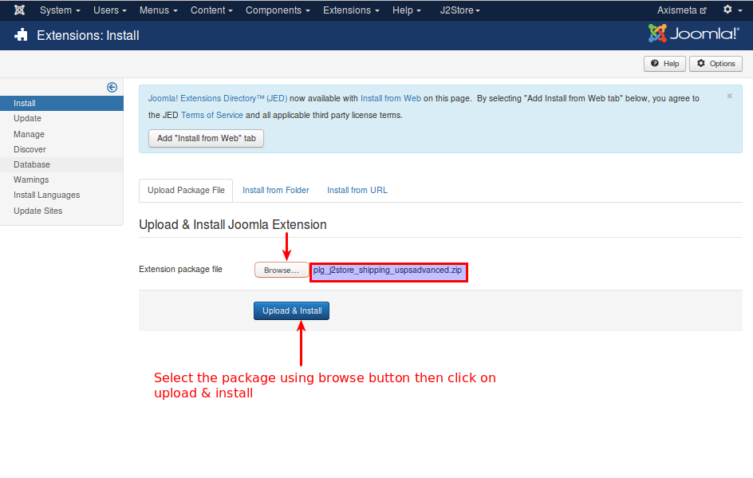

# UPS Shipping

This plugin integrates UPS Shipping Rate API with J2Store.

**Requirements**

* PHP 5.3+
* Joomla 2.5 / 3.x +
* J2Store 2.6.8 +**‌**

**Configuration** Prior to configuring the plugin, you should have an active account with the UPS and received API keys. Contact UPS to register and get API keys.

**‌**Installation You can install this USP shipping plugin, using joomla installer. The following steps help you for successful installation.

‌

**Step 1** In the Joomla admin, go to Extensions -&gt; Extension Manager -&gt;install

 **step 2** Click on the Browse button and select USPS Shipping \(type=j2store\) and click on Upload & Install

 **step 3** Select J2store -&gt;setup -&gt; shipping methods

**Step 4**

* Now, the USPS Advanced shipping for J2Store page will appear on the screen.
* Enable the plugin.
* Configure the shipping plugin by entering the plugin parameters.

‌

## Parameters:

‌**Access Key:** Enter your Access key associated with your UPS Shipping account.

**User Name:** Enter the username of your UPS services account.

**Password:** Enter the password of your UPS services account.

‌**Shipper Number:** Enter the Shipper number provided by the UPS

‌**Sandbox/Test Mode:** The option allows you to test the SquareUp gateway using SquareUp sandbox server instead of the live one. You may use this option to test the plugin if you don't have a SquareUp Account yet.

‌**Parcel Packing Method:** You may select the parcel method for packing the products.

‌**UPS Packaging Box:** You may consider selecting the available UPS box.

Note: If you choose Pack into boxes with weights and dimensions \(Recommended\) but have not chosen any UPS Packaging, nor defined any custom boxes \(as explained below\), the plugin displays the error message: “UPS is enabled, and Parcel Packing Method is set to ‘Pack into boxes’, but no UPS Packaging is selected and there are no custom boxes defined. Items will be packed individually.”

‌**Custom Box:** You may enter the dimensions here the items will be packed into these boxes based on item dimension and volume. Outer dimension will be passed to UPS, whereas inner dimension will be used for packing. Items not fitting into boxes will be packed individually.

This Custom Box is to be chosen only when “Box packing” is selected.

‌**Handling Cost:** Apply an additional fee to the shipping cost calculated.

‌**Send product amount to UPS:** If you wish to sent the product price to the UPS then you may set it to as Yes.

‌**From Residential Address:** If your store is in a residential place then consider setting this to Yes.

‌**Enable negotiated Rate:** Set this to Yes for negotiated rate.

‌**Delivery Confirmation option:** You can confirm the delivery using signature in UPS.

‌**Services:** Select the UPS services to be offered.

‌**Pickup type:** Choose the required  pickup type here.‌

**Packaging:** Choose the required  packaging type here.

‌IMPORTANT NOTE: Please set the Weight Unit as "Pound" and Length Unit as "Inch" for USA , others country set Weight unit as "Kilogram" and Length unit as "Centimeter".

‌**Weight Unit:** If product have weight unit 5kg, In plugin weight unit Pound, then it will covert the 5kg to pound.

‌**Show weight total:** Set this to Yes to show the weight total along with the shipping service name.

‌**Length unit:** If product have length unit 5 cm, In plugin length unit inch, then it will convert  5cm to Inch.

**Tax Class:** Here you can specify the Tax class to charge the Tax on shipping. Leave empty if you do not want to charge tax.

‌**Geozone:** If you choose a Geozone, then this shipping plugin will apply only to customers coming from the countries/zones added under the chosen Geozone. Leave empty to show the method to all Geozones.

‌**Debug:** If you set this to Yes, the system will log the requests and responses, which will help you debug. The logs will be saved in the Cache folder. 

**Note:** In production environment, it must set NO.

‌**Shipping origin Address:** Enter the address from where you ship.

‌**Shipping Origin City:** Enter the city from where you ship.

‌**Shipping Origin Zin/Postalcode:** Enter the Postcode from where you ship.

‌**Country:** Select the Country from where you ship.

**‌Zone:** Select the Zone from where you ship.

