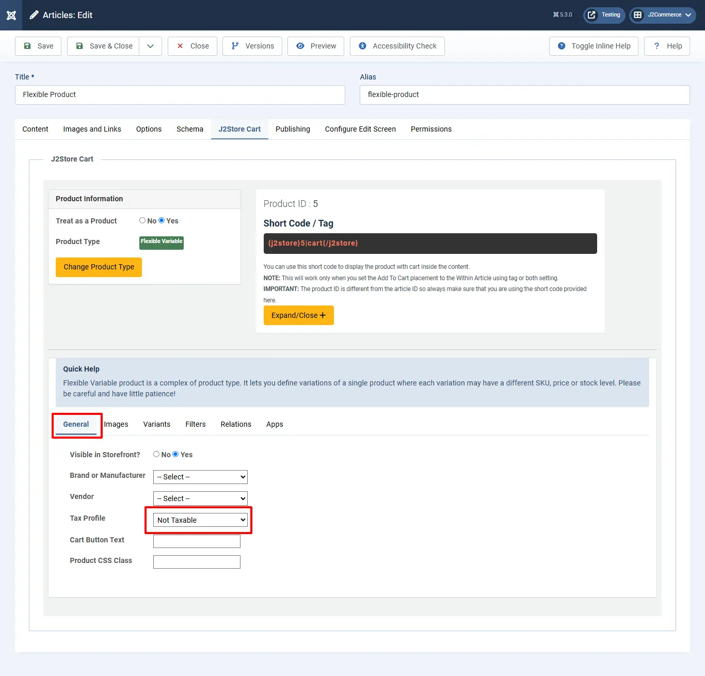

# Recommended Tax configuration for US States

This is an example setting for stores in United States. This also applies to many other countries that follow a US style of tax system. For detailed information on tax, please consult an expert.

**Note:** Current US law requires you to collect taxes where you have an interest/ongoing concern — that is, where you have physical stores, distribution centers, headquarters, and so on. For many online stores there is only one location. However, if you have stores that operate in many states or countries, or if you have revenues exceeding approximately $2M per year, we recommend that you use a third-party tax provider because there can be a considerable number of tax rules and tax zones to manage.

**Important:** No guarantee is offered with respect to any of the information given here. Please contact an expert before you take any decisions about tax matters

\*\*NOTE:\*\*The example given below, assumes you have a store in Texas and you charge 8.5% tax on the goods sold to customers in Texas. All customers coming from other states are NOT taxed

## Step 1 : Create a geozone for Texas 

<figure><figcaption>
Geozone setup
</figcaption></figure>

<figure><figcaption>
Geozone setup
</figcaption></figure>

Go to Localization -> Geozones -> New

**Geozone Name:** Texas Zone

**Country :** United States

**Zone :** Texas

## Step 2: Create a tax rate 

Go to Localization -> Tax Rates -> New

<figure><figcaption>
Tax Rate Setup
</figcaption></figure>

<figure><figcaption>
Tax Rate Setup
</figcaption></figure>

**Name :** Sales Tax (you can give any name here)

**Tax Percent :** 8.5

**Geozone :** Texas Zone

**Enabled:** Yes

## Step 3: Create a tax profile and rules 

Go to Localization -> Tax Profiles -> New

<figure><figcaption>
Tax Profile Setup
</figcaption></figure>

<figure><figcaption>
Tax Profile Setup
</figcaption></figure>

**Name:** Default Tax Class

**Enabled:** Yes

**Tax rules**

Click Add

**Rate:** Sales Tax

\*\*Associated Address: \*\* Shipping

## Step 4: Configure tax settings 

Go to Components > J2Commerce > Setup > Configuration > Tax tab

<figure><figcaption>
Tax setup
</figcaption></figure>

<figure><figcaption>
Tax setup
</figcaption></figure>

**Prices entered with tax:** No, I will enter prices EXCLUSIVE of tax

**Calculate tax based on:** Shipping address

**Default customer address:** Store address

**Display prices in product pages:** Excluding tax

**Display tax information below the prices:** Example: (Incl. 19% tax). NOTE: This applies only to product pages

**Display prices in cart / checkout :** Excluding tax

**Apply discounts :** Before tax

Save.

## Step 5: Add the tax profile to a product 

J2Commerce uses Joomla! articles as products. So go to Article Manager and create a New Article / Product (If you use any other catalog source like Zoo or Sebold, you should head there).

Product creation steps are explained under the topic **Products**.

Here let us just see how to choose the tax profile

Go to J2Commerce (or J2Store Cart) tab  > **General tab**

**Tax Profile :** Default tax class

**IMPORTANT** If you do not choose the tax profile, then tax will not apply in the store front.

**Video Tutorial:**


