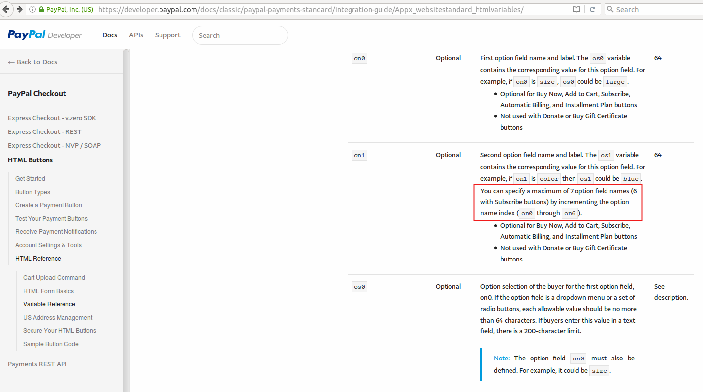
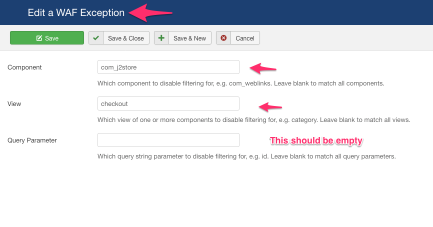

# Troubleshooting Paypal related Issues

There could be many reasons why your Paypal Plugin is not working. This guide lists most common reasons and solutions for them.

* Orders not confirmed. Status shows as incomplete or new
* Order status Failed
* Currency is wrong. Paypal payment screen shows USD while my currency is different
* paypal duplicate invoice ID and how to solve it
* Paypal option not showing at checkout
* Is your order still not auto confirming the status
* Make order status confirmed immediately

## 1. Orders not confirmed. Status shows as incomplete or new 

It means you are not getting the Instant Payment Notification \(IPN\) from Paypal.The IPN may not reach your site, if :

* The Site is offline
* The Site is in local server / local host / live in your local machine
* You have created a menu for the Checkout and set its access level to Registered or Special or Something other than public.
* You have a firewall installed either in your site or by your host
* You have disabled IPN in your Paypal account.

### Solutions to above issues : 

1. Go to Joomla adminGlobal configuration. Set Site Offline to No
2. Host your site
3. Set the Checkout menu access level to Public
4. If you have a firewall like Admin Tools, then you can add Exceptions. Please consult with your firewall provider or with your host.

if your site or your hosting server has a firewall \(you can check with your host\), then you may have to whitelist the Paypal’s server IPs

Here you can get a list of IPs used by the Paypal servers [click here](https://www.paypal.com/lc/smarthelp/article/what-are-the-ip-addresses-for-live-paypal-servers-ts1056)

Paypal makes a remote post \(IPN\) to your site when a payment is made to inform us that payment has been made and you can mark the order complete. Firewalls normally block remote posts. So we may have to whitelist the IPs allowing them to do the remote post.

### Enable the IPN in your Paypal account 

Login to your Paypal account

Click Profile on the My Account tab.

Click Instant Payment Notification Preferences in the Selling Preferences column.

Click Choose IPN Settings to specify your listener’s URL and activate the listener.

In the Listener’s url enter the following url

> [http://DOMAIN](http://domain/)&gt;/index.php?option=com\_j2store&view=checkout&task=confirmPayment&orderpaymenttype=payment\_paypal&paction=process&tmpl=component

NOTE: ReplaceDOMAIN&gt; with your website. E.g:blank” rel=“noopener”&gt; click here

Still no luck, check the IPN HistoryLogin to your paypal account and go to History -&gt; IPN history. Check the recent IPN history and check the status.If possible take a screenshot and contact our support team.

## 2. Order status Failed 

Are you using your Primary Paypal Email as your merchant email? If your order status says failed, then chances are that you are using a secondary email of your Paypal account.

Paypal allows you to add multiple emails in an account to accept payments. With the Paypal plugin for J2Store, make sure you are using your primary Paypal account email. You can check which is your primary email by signing into your Paypal account and then going to Profile -&gt; Add / Edit emails page.

## 3. Currency is wrong. Paypal payment screen shows USD while my currency is different 

Paypal supports multiple currencies. However, it does not support all currencies of the world. Please ensure that your currency is supported by checking this page: [click here](https://www.paypal.com/multicurrency)

If your currency is not supported, Paypal will automatically assume the currency as USD.

A workaround to this problem : Allow customers to shop in your currency and convert it to USD when they are redirected to paypal for payment.

Here is a step by step guide to set up auto conversion of your currency to USD.

Let us assume, your store is located in India and your currency is INR. But Paypal does not support INR.

Here is how you can overcome the issue.

Step 1: Enable Auto currency update

Go to Joomla admin - j2store - set up - &gt; configuration -&gt; Store tabSet your Default Currency as INRSet Auto update currency to YES

Step 2: Create multiple currencies

Go to Joomla admin - j2store - set up - currencies

You might have already created the INR currency. Open it and make sure its value is set to 1

**Now, create a new currency**

 Currency Name: USD

Currency Code: USD

Currency Symbol: $

Decimal places: 2

Decimal Separator: .

Thousands separator: ,

Value: 0.061 \(You can enter any value less than 1. Once saved, J2Store will automatically contact Yahoo Financial services and update the correct exchange value \)

Status: Published

Save now.

 You are all set now. Prices in your store will now display in INR. When the customer is redirected to paypal, he will be asked to pay in USD.J2Store will automatically do the currency conversion depending on the prevailing exchange rate.

## 4. Paypal duplicate invoice ID and how to solve it 

Paypal by default does not allow duplicate invoices. When you try to pay for a duplicate invoice id, Paypal will produce the following error:

The transaction was refused as a result of a duplicate invoice ID supplied. Attempt with a new invoice ID

If this were to happen, one of the reasons could be that the configuration in Paypal is set to not accept duplicate invoices. You may receive orders from various places and if the invoice numbers are the same, Paypal recognises there is an invoice duplication.

There are two ways, by which you can fix this.

**Solution 1: Set the Invoice Prefix**

Please follow the steps:

1. From your J2Store Dashboard, go to - Set Up -&gt; Configuration -&gt; Order

> Note: This step is for V3. If you are using v2, then go to Set Up -&gt; Store Profiles -&gt; your store profile

1. Set the Invoice Prefix in the textbox provided, for e.g., INV-2020- or INV/2020/
2. Save & Close.

**Solution 2: Change settings in Paypal**

Please try the following:

1. Log-in to your Paypal account
2. Click Profile
3. Under Selling Preferences, click Payment Receiving Preferences
4. Under Block Accidental Payments choose “No, allow multiple payments per invoice ID”.
5. Save.

## 5. Paypal option not showing at checkout? 

Make sure the Geozone field at paypal plugin configuration page is set to ALL.

By selecting a geozone here, you can restrict this payment method to only customers of that geo-region. Choose All geozones to show this method to all customers.

Go to J2Store &gt; Setup &gt; Payment methodsOpen Paypal payment pluginSet Geozone to ALLSave.

## 6. Is your order still not auto confirming the status? 

Here is one more troubleshooting stepGo to Joomla administration -&gt; Global config -&gt; Server -&gt; Database settingsMake sure your Database driver is NOT set to MySQL PDO.

## 7. Make order status confirmed immediately 

Is your PayPal’s account default currency is different from your store currency ?Only if the currency is different, PayPal will send the payment status as Pending.

Login to your PayPal account -&gt; profile -&gt; Selling preferences.

You will find a switch:

Allow payments sent to me in a currency I do not hold:Set this to: Yes, accept and convert them to US Dollars. Additional charges apply.

Otherwise, your PayPal account requires you to manually accept each transaction \(by logging in to your Paypal Acount\)

If PayPal sends the payment status as Completed, J2Store will automatically mark the transaction as Confirmed.

## 8. Security Header is not Valid: 

This error occurs only when the credentials are not correct. Please remove the API keys\(they are not mandatory fields. You could use Paypal by just mentioning the merchant email\) from Paypal plugin settings.

You can refer the below link for better understanding: [https://help.perfexcrm.com/security-header-not-valid-when-setting-up-paypal/](https://help.perfexcrm.com/security-header-not-valid-when-setting-up-paypal/)

## 9. How do I implement this fail-safe method ? 

In the event of IPN not reaching your site, you can make sure that the transactions at your site and PayPal could be collated using a cron job

Make sure you have J2Store 3.2.21 Login to your hosting cPanel and set up a cron job The cron job command should be: \(You can set this to run at 15 minutes intervals\)

**Non-ssl**

 wget -O /dev/null “http://DOMAINNAME&gt;/index.php?option=com\__j2store&view=cron&command=paypalcollation&cron\__secret=XXXXX” &gt; /dev/null

**SSL**

 wget —no-check-certificate -O /dev/null “https://DOMAINNAME&gt;/index.php?option=com\__j2store&view=cron&command=paypalcollation&cron\__secret=XXXXXX” &gt; /dev/null

 NOTE: Replace DOMAINNAME with your domain name Replace XXXXXX with your cron secret key, which you can find at Joomla Administration -&gt; J2Store -&gt; Set up -&gt; Configuration -&gt; Store.

There could be many reasons why your Paypal Plugin is not working. This guide lists most common reasons and solutions for them.

## 10. Things don’t appear to be working at the moment. Please try again later 

Paypal has recently rolled out their cool ” New Checkout! ”

With this Paypal also seems to impose certain new technical restrictions

Specified Character length for address fields, Product name and Product options. Length varies based on fields and is specified on their integration guide. Number of product options sent to paypal are limited to 7 options. This could be due to the recent technical restrictions imposed by paypal: \(refer below image\)

**How to fix it ?** We have updated the paypal plugin with fixes for these new technical restrictions. Please make sure you update your paypal plugin to latest \(v.3.4\)With this update if you have used more than 7 options then the first 7 options are passed to paypal and others are ignored. Similarly if the product option character length is larger than allowed by paypal, those values are trimmed \(cut off\). This will make sure you do not get any errors and customers will continue to see checkout screen without any issues.

NOTE: Please take a backup before updating the plugin and test after installing.

**Here is another possible reason \(this might also cause this error\)** You might have enabled the Encrypted Website Payments. Try the following steps to solve this.

* Log in to your PayPal account.
* Click Profile.
* From the Selling Preferences column, click Website Payment Preferences.
* In the Encrypted Website Payments section, select Off.
* Click Save.

Also check if your PayPal account is approved to receive payments.

## 11. Admin tools PRO exception 

All firewalls including the Admin Tools PRO would normally block any server-to-server remote POST requests. PayPal sends the IPN callback notification as a remote POST request immediately after the customer makes the payment.

In order to allow this request to pass through your firewall, you need to add an exception

Here is a screenshot of the WAF Exception in Admin Tools PRO

#### **Currency you are using**

Paypal supports only the following currencies:

 [click here](https://developer.paypal.com/docs/api/reference/currency-codes/)

So, if you are trying to receive payment through Paypal, it becomes necessary that your store currency is one among the above listed currencies. All other currencies would return a Things don’t seem to be working at the moment error.

#### Why the paypal payment form not works ? 

It seems due to the param “Block non-encrypted Website Payments” has been enabled inside your paypal account settings.

Disabling this param will solve this problem.

Block non-encrypted Website Payments = disable.

 

If you still have issues with Paypal plugin, please reach us through the support form or the ticket system.

